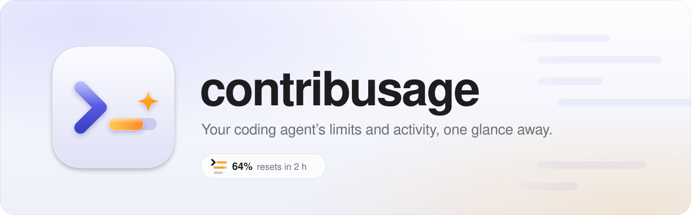
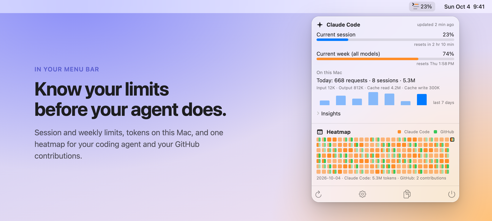
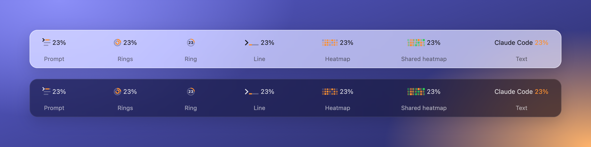

<p align="center">
  <picture>
    <source media="(prefers-color-scheme: dark)" srcset="docs/assets/header-dark.svg">
    
  </picture>
</p>

<p align="center">
  <a href="https://github.com/kuehn-lars/contribusage/actions/workflows/ci.yml"></a>
  
  
  
  
  
  
  <a href="LICENSE"></a>
  <a href="https://github.com/kuehn-lars/contribusage/releases"></a>
</p>

<p align="center">
  <b>contribusage</b> is a native macOS menu bar app that shows how much of your AI coding plan is left,<br>
  what your coding agent did on this Mac, and your GitHub contributions, without ever touching your credentials.
</p>

<p align="center">
  <picture>
    <source media="(prefers-color-scheme: dark)" srcset="docs/assets/screenshot-dark.png">
    
  </picture>
</p>

## Highlights

- **Limits.** Every usage window your coding agent reports, such as the current session and the current week, with its percentage and the time it resets. Bars turn orange at 70 % and red at 90 %.
- **Activity.** Requests, sessions and tokens for today and the last seven days, read from the transcripts Claude Code already writes, plus the insights it prints with `/usage`.
- **Combined heatmap.** Your agent's daily activity and your GitHub contribution calendar in one grid, combined or stacked, with today's count and your streak.
- **Menu bar label.** Seven drawn styles, each in color or monochrome, and your choice of window: session, week, the highest one, or GitHub today.
- **Notifications.** Alerts at the thresholds you pick, and another one when a window resets.
- **Privacy.** No credentials read, no vendor backend called, no analytics. The only server the app itself talks to is `api.github.com`.
- **Native.** Swift 6 and SwiftUI, arm64 only. Probing Claude Code every minute, the release build uses about 0.08 % CPU and 23 MB of memory (measured in [R-1](llm-wiki/research/r-1-probe-cost.md)).

<p align="center">
  
</p>

## How it works

contribusage reads only what your tools already show you, through their official interfaces.

| Data | Source | How often |
|---|---|---|
| Plan limits | `claude -p "/usage"`, the official CLI with your own login, run in an empty folder | Every 5 minutes by default, down to every minute |
| Activity | Claude Code's transcript files under `~/.claude/projects`, counted locally | As the files change |
| Contributions | GitHub's GraphQL API, with a read-only token you paste in | Every 10 minutes to 6 hours |

The windows you see are exactly the ones Claude Code prints for your plan. When Claude Code adds or drops a window, the app follows without an update.

### Privacy and safety

- **Your agent's credentials stay untouched.** The app never reads Claude Code's Keychain item or credential file and never calls `api.anthropic.com` or `claude.ai`. Instead of reading the OAuth token and calling an undocumented endpoint, it runs the `claude` binary the way you would in Terminal. The reasoning is in [SPEC §2.1](SPEC.md#21-why-principle-2-matters-claude-code).
- **The GitHub token lives in your Keychain**, is never logged, and is never shown again after you connect.
- **Transcripts are only counted.** The app decodes the fields it counts (timestamps, models, token counts) and never keeps prompt or message text.
- **No telemetry, no cloud, no crash reporter.** Everything stays in `~/Library/Application Support/contribusage`.

## Requirements

- A Mac with Apple Silicon (M1 or later) on macOS 14 Sonoma or later
- [Claude Code](https://code.claude.com) installed natively and logged in with a subscription (`claude` works in Terminal)
- Optional: a GitHub personal access token with read-only access, for the contribution calendar

## Install

Download `contribusage-<version>.dmg` from the [latest release](https://github.com/kuehn-lars/contribusage/releases/latest), open it and drag contribusage to your Applications folder. To check that the DMG is the one CI built, see [Verify a download](SECURITY.md#verify-a-download).

> [!IMPORTANT]
> contribusage is not signed with an Apple Developer ID or notarized, because the project has no Apple Developer account. On first launch macOS therefore refuses to open it and says it cannot verify the developer. This is expected. You get past it once with one of the two methods below.
>
> **Recommended: Terminal (always works).** After moving contribusage to Applications, remove the quarantine flag macOS set on the download, then open the app normally:
>
> ```bash
> xattr -dr com.apple.quarantine /Applications/contribusage.app
> ```
>
> **Alternative: System Settings.** Open contribusage once and close the warning, then go to System Settings → Privacy & Security, click **Open Anyway** next to the message about contribusage and confirm. This needs an administrator account.

## Build from source

An app you build yourself opens without the warning above. Building needs Xcode 26 or later.

```bash
git clone https://github.com/kuehn-lars/contribusage.git && cd contribusage
swift test --package-path Packages/ContribusageKit -Xswiftc -warnings-as-errors
xcodebuild -project Contribusage.xcodeproj -scheme Contribusage -configuration Debug -derivedDataPath .build/xcode build
open .build/xcode/Build/Products/Debug/contribusage.app
```

More commands are in [SPEC §15.6](SPEC.md#156-everyday-commands). The app icon is an Icon Composer document, [`App/AppIcon.icon`](App/AppIcon.icon): macOS 26 and later render it in Liquid Glass with light, dark, clear and tinted variants, and Xcode builds a flat fallback for macOS 14 and 15.

## Roadmap

- **Notarized download:** Developer ID signing and notarization may follow at a later stage, if the project finds enough users; the DMG then opens without the step above.
- **Status line bridge:** Live limits after every message in an active Claude Code session, through Claude Code's documented status line ([T-6.2](SPEC.md#176-phase-6-optional-and-release-m5)).
- **More coding agents:** The provider framework is in place; Codex CLI is the next candidate ([ADR-037](llm-wiki/decisions/0037-no-second-provider-for-v1.md)).

## How this repository works

contribusage is built spec-first, with coding agents, and everything they need lives in the repository:

- [`SPEC.md`](SPEC.md) is the contract: requirements with stable IDs, the task plan, open research.
- [`llm-wiki/`](llm-wiki/) is the project's memory: an [Obsidian](https://obsidian.md) vault the agents maintain, following Andrej Karpathy's LLM-wiki pattern. It holds a page per module, the architecture decisions, research findings and a change log. Start at [`overview.md`](llm-wiki/overview.md), or open the folder as a vault for the graph view.
- [`AGENTS.md`](AGENTS.md) is the protocol every agent follows: orient in the vault, work against the spec, record what changed.

## Acknowledgements

- [**ccusage**](https://github.com/ryoppippi/ccusage) by [@ryoppippi](https://github.com/ryoppippi) is the reference implementation for counting Claude Code's tokens from its transcripts. contribusage's daily totals were checked against `ccusage daily` and match within 1 %.
- [**Claude Code**](https://code.claude.com) is the coding agent this app watches. The app reads it only through its official CLI and the transcript files it writes.
- Andrej Karpathy's [**LLM-wiki pattern**](llm-wiki/sources/karpathy-llm-wiki.md) shapes the project memory in `llm-wiki/`, kept in [**Obsidian**](https://obsidian.md).
- Apple's **Icon Composer** and **SF Symbols** give the app its icon and its interface symbols.
- [**Shields.io**](https://shields.io) draws the badges above.

## License

contribusage is released under the [MIT License](LICENSE).

## Trademarks

contribusage is an independent project. It is not affiliated with, endorsed by or sponsored by Anthropic or GitHub. Claude and Claude Code are trademarks of Anthropic, PBC. GitHub is a trademark of GitHub, Inc. Apple, macOS and Apple Silicon are trademarks of Apple Inc.
