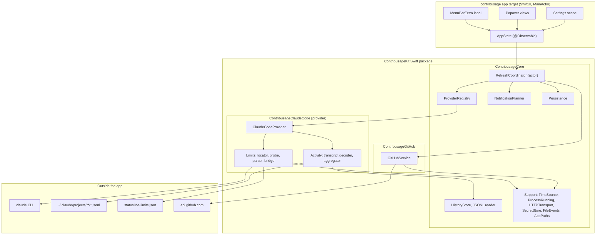

# contribusage: Specification

> A native macOS menu bar app for Apple Silicon that shows the usage of your AI coding tools (starting with Claude Code) and your GitHub contributions at a glance.

| | |
|---|---|
| **Product name** | contribusage (lowercase, one word: *contrib*utions + *usage*) |
| **Spec version** | 0.1 (Draft) |
| **Date** | 2026-09-28 |
| **Platform** | macOS 14 Sonoma or later, **Apple Silicon (arm64) only** |
| **Language** | Swift 6, SwiftUI |
| **Providers in v1** | Claude Code (more AI coding tools later, see [section 7](#7-provider-model)) |
| **Development style** | Spec Driven Development: this file is the source of truth. Code follows the spec, not the other way around. |

---

## Table of contents

0. [How to use this spec](#0-how-to-use-this-spec)
1. [Vision, goals and non-goals](#1-vision-goals-and-non-goals)
2. [Constitution: non-negotiable principles](#2-constitution-non-negotiable-principles)
3. [Glossary](#3-glossary)
4. [User stories and acceptance criteria](#4-user-stories-and-acceptance-criteria)
5. [Functional requirements](#5-functional-requirements)
6. [Non-functional requirements](#6-non-functional-requirements)
7. [Provider model](#7-provider-model)
8. [Data sources](#8-data-sources)
9. [Architecture](#9-architecture)
10. [Data model and interfaces](#10-data-model-and-interfaces)
11. [UI specification](#11-ui-specification)
12. [Refresh policy](#12-refresh-policy)
13. [Error handling](#13-error-handling)
14. [Security and privacy](#14-security-and-privacy)
15. [Project setup](#15-project-setup)
16. [Testing strategy](#16-testing-strategy)
17. [Implementation plan and tasks](#17-implementation-plan-and-tasks)
18. [Decision log](#18-decision-log)
19. [Open questions and risks](#19-open-questions-and-risks)
20. [Known macOS and Apple Silicon pitfalls](#20-known-macos-and-apple-silicon-pitfalls)
21. [Appendices](#21-appendices)

---

## 0. How to use this spec

This file drives the whole project. The workflow for every change, whether done by you or by Claude Code:

1. **Pick a task** from [section 17](#17-implementation-plan-and-tasks). Tasks reference requirement IDs (`FR-…`, `NFR-…`).
2. **Read the referenced requirements** and the relevant provider, data source and interface sections.
3. **Write the tests first** (fixtures and expected values come from this spec and its appendices).
4. **Implement** until the tests pass. Keep each task a small, reviewable change.
5. **Check the task box** and, if reality differed from the spec, **update the spec in the same commit**. A spec that drifts from the code is a bug.

Agents follow [`AGENTS.md`](AGENTS.md), which adds the project memory in [`llm-wiki/`](llm-wiki/): every change also updates the vault pages that describe it. This file says *what* to build; the vault records *how* it was built, *why*, and where work stands.

Rules for changing the spec:

- Requirements are never silently deleted. Mark them `~~struck~~` with a note, or move them to the decision log.
- Every resolved research item ([section 19](#19-open-questions-and-risks)) updates the section it affects and gets a line in the decision log.
- IDs are stable. New requirements get the next free number.
- **Adding an AI coding tool** always starts in this file: pass the provider gate ([2.4](#24-provider-gate)), add a provider section under [section 8](#8-data-sources) using the template in [Appendix F](#appendix-f-provider-section-template), then add tasks. No provider code without its spec section.

---

## 1. Vision, goals and non-goals

### 1.1 Vision

One glance at the menu bar tells me how much of my AI coding plan I have left and when it resets. One click shows my coding activity on this Mac and my GitHub contribution graph. The app is quiet, fast, private, native to Apple Silicon and never puts my accounts at risk. Today it knows Claude Code; tomorrow it can learn other AI coding tools without a rewrite.

### 1.2 Goals

| ID | Goal |
|---|---|
| G-1 | Show the current Claude Code plan usage windows (session, weekly, any additional window) with percentage and reset time. |
| G-2 | Show Claude Code activity from this Mac: requests, sessions and tokens for today and the last 7 days. |
| G-3 | Show the GitHub contribution calendar, today's count and the current streak. |
| G-4 | Warn me before I hit a limit (notifications at configurable thresholds). |
| G-5 | Use only official, permitted interfaces of every integrated tool. Never touch credentials that belong to other apps. |
| G-6 | Be a good citizen on Apple Silicon Macs: native arm64 binary, negligible CPU and battery use, native look, dark mode, accessibility. |
| G-7 | Be provider ready: adding another AI coding tool means adding one provider module and one spec section, without changing other providers, the scheduler, the notification logic or existing persistence formats. |

### 1.3 Non-goals (for v1)

- **No Intel Macs.** No universal binary, no x86_64 slice, no Rosetta testing ([ADR-009](llm-wiki/decisions/0009-apple-silicon-only.md)).
- No Windows or Linux version.
- No Mac App Store distribution (the app needs to launch tool binaries such as `claude` and read `~/.claude`, see [ADR-006](llm-wiki/decisions/0006-no-app-sandbox.md)).
- **No AI coding tools other than Claude Code in v1.** The provider framework exists from day one, but further providers are future work ([7.6](#76-future-provider-candidates)).
- No multi-account support (one login per provider, one GitHub account).
- No data from claude.ai chat history, other devices, or tools that are not integrated as a provider.
- No team or organization dashboards, no Admin API usage.
- No cloud sync, no telemetry, no backend server.
- No exact billing. Any "API-equivalent cost" is an estimate and optional ([FR-40](#58-optional-features-p3)).
- No combined or summed limits across providers. Each tool's limits are shown as that tool reports them.

---

## 2. Constitution: non-negotiable principles

These principles override any task, shortcut or "quick fix". If a task conflicts with a principle, the task is wrong.

1. **Official interfaces only.** Data about an AI coding tool comes exclusively from that tool's official, unmodified user facing interfaces (its CLI, its documented hooks or status features) and from files the tool writes on this Mac. For Claude Code this means the official `claude` CLI, its documented status line feature and the transcripts it writes. GitHub data comes exclusively from GitHub's official API.
2. **Never touch other apps' credentials.** The app never reads, copies, stores or forwards any tool's OAuth tokens, API keys, Keychain items, credential files, browser cookies or session tokens. It never calls a tool vendor's backend directly. For Claude Code: no access to its Keychain item or `~/.claude/.credentials.json`, no calls to `api.anthropic.com` or `claude.ai`.
3. **Local first and private.** All data stays on this Mac. The only network destination the app itself contacts is `api.github.com`. No analytics, no crash reporters that phone home.
4. **Honest data.** Every value shows its age, its source and its provider. Unknown is shown as unknown, never as `0 %`. Stale data is visibly marked as stale.
5. **Frugal.** Event driven wherever possible. Background work is bounded, scheduled with tolerance and paused when pointless (asleep, offline, Low Power Mode). Adding providers must not multiply idle cost.
6. **Fail soft.** One broken source or provider never breaks the others. Parsing failures degrade to "show raw text", not to crashes or blank UIs.
7. **Testable core.** All parsing and logic lives in the `ContribusageKit` Swift package, is covered by fixture based tests, and is written test first.
8. **Provider isolation.** Everything specific to one tool lives in that tool's provider module. The core and the UI know only the provider protocols. The core never imports a provider module; this is enforced by the package's target graph.
9. **Small increments.** One task, one focused change, tests green before the next task.

### 2.1 Why principle 2 matters (Claude Code)

Anthropic's Claude Code legal and compliance page states that OAuth sign-in is meant for Claude Code and Anthropic's own apps, that developers may not collect, store or intermediate Claude.ai credentials or session tokens, and that Anthropic may enforce this without prior notice. Many community tools read Claude Code's token and call an undocumented usage endpoint. This app deliberately does not. Running the official `claude` binary with the user's own login is ordinary use of Claude Code.

This is the project's own reading of the terms, not legal advice. Reference: <https://code.claude.com/docs/en/legal-and-compliance>

Every future provider needs an equivalent paragraph for its own vendor's terms before any code is written ([2.4](#24-provider-gate)).

### 2.2 GitHub

The app uses a personal access token that the user creates and pastes in (or imports from the GitHub CLI with consent). It stores the token only in the macOS Keychain and requests only read access.

### 2.3 Naming and trademarks

- The product name is **contribusage**, always written in lowercase in the UI and documentation.
- The name, icon and bundle identifier must not contain "Claude", "Anthropic", "GitHub" or the name of any other integrated tool or vendor, and must not use their logos. The bundle identifier follows the pattern `dev.<yourname>.contribusage`.
- Provider and service names appear only as plain descriptive text ("Claude Code", "GitHub"). Each provider gets a neutral SF Symbol in the UI, never a vendor logo.
- Before any public release, check the availability of the name (App Store and web search, domain, trademark databases), tracked as Q-6.

### 2.4 Provider gate

Before any code for a new AI coding tool is written, all of the following must be done and committed to this spec:

1. **Terms review.** Read the vendor's terms regarding automation, third party tools and credentials. Summarize them in the provider section, with links, in the same style as 2.1.
2. **Interface inventory.** List the official interfaces that expose usage or limits (CLI commands, documented hooks, status features, local files the tool writes). Mark each as documented or undocumented.
3. **Compliance decision.** For each capability (limits, activity, insights), decide whether it can be built within principles 1 and 2. A capability that can only be built by reading credentials or calling undocumented vendor endpoints **is not built**. Record the decision as an ADR.
4. **Research items.** Add research items (output variants, file formats, cost of polling) to [section 19](#19-open-questions-and-risks).
5. **Provider section.** Add a section under [section 8](#8-data-sources) from the template in [Appendix F](#appendix-f-provider-section-template), including window classification and token categories.
6. **Tasks.** Add a phase to [section 17](#17-implementation-plan-and-tasks).

---

## 3. Glossary

| Term | Meaning |
|---|---|
| **Provider** | One AI coding tool integrated into contribusage behind the provider protocols ([section 7](#7-provider-model)). v1 ships exactly one: Claude Code. |
| **Provider ID** | Stable lowercase identifier of a provider, for example `claude-code`. Used in settings keys, persistence paths and notification keys. Never changes once released. |
| **Capability** | What a provider can deliver: `limits`, `activity`, `insights`. |
| **Limits source** | The part of a provider that produces usage windows (for Claude Code: the `/usage` probe plus the optional status line bridge). |
| **Activity source** | The part of a provider that produces per day activity (for Claude Code: local transcripts). |
| **Usage window** | One plan limit bucket as reported by a provider, for example Claude Code's "Current session" (rolling 5 hour window) or "Current week (all models)". Has a used percentage and a reset time. |
| **Window kind** | Provider neutral classification of a usage window: `session`, `weekly` or `other`. Used by the menu bar and settings; the label itself is always shown verbatim. |
| **Probe** | (Claude Code) One execution of `claude -p "/usage" --no-session-persistence` by the app. |
| **Probe folder** | (Claude Code) A dedicated empty directory the probe runs in: `~/Library/Application Support/contribusage/providers/claude-code/probe/`. |
| **Status line bridge** | (Claude Code) Optional shell script registered as Claude Code's `statusLine` command that mirrors `rate_limits` JSON into a file the app watches. |
| **Transcript** | (Claude Code) A JSONL file Claude Code writes per session under `~/.claude/projects/`. |
| **Activity** | Aggregated usage derived from a provider's local data: requests, sessions, token counts per day. |
| **Contribution calendar** | GitHub's per day contribution counts for the last year. |
| **Snapshot** | A value plus `fetchedAt` timestamp plus origin (and provider where applicable). Everything the UI shows is a snapshot. |
| **Stale** | A snapshot older than the staleness threshold of its source ([section 12](#12-refresh-policy)). |
| **Popover** | The window that opens when clicking the menu bar item (`MenuBarExtra` with `.window` style). |

---

## 4. User stories and acceptance criteria

Priorities: **P1** = MVP (Milestones M1 and M2), **P2** = v1.0, **P3** = later / optional.

### US-1 (P1): See my Claude Code limits at a glance

*As a Claude subscriber, I want to see my current session usage in the menu bar so I know whether I can start a big task.*

- **Given** Claude Code is installed and logged in with a subscription, **when** the app has completed a probe, **then** the menu bar shows the primary window's percentage (default: the Claude Code window of kind `session`, "Current session"), for example `23%`.
- **Given** no probe has succeeded yet, **then** the menu bar shows the icon with `?` and the popover explains why.
- **Given** the last successful probe is older than the staleness threshold, **then** the value is shown dimmed and the popover says "updated 42 min ago".

The menu bar criteria arrive with FR-12 in M4 (T-5.10); until then the menu bar shows a static icon and the popover carries US-1.

### US-2 (P1): Understand when limits reset

*As a user close to a limit, I want to see when each window resets.*

- **Given** a usage window with a reset time, **then** the popover shows a progress bar, the percentage, a relative countdown ("resets in 2 h 10 min") and the absolute local time on hover ("Mon 28 Sep, 04:09").
- **Given** the reset time has passed, **then** the window is shown as "reset, refreshing…" and a refresh of that provider's limits is scheduled immediately (subject to the minimum interval).
- Reset times from the Claude Code output (which includes an IANA time zone) are converted to the Mac's current time zone for display.

### US-3 (P2): Get warned before hitting a limit

- **Given** notifications are enabled and a window crosses a threshold (defaults 80 % and 95 %), **then** exactly one notification is sent per threshold per window per reset cycle. The notification names the provider and the window ("Claude Code: Current session at 80 %").
- **Given** the window resets, **then** thresholds re-arm. An optional "limit has reset" notification is off by default.

### US-4 (P1): See my GitHub contributions

- **Given** a valid GitHub token is stored, **then** the popover shows a contribution heatmap of the last 26 weeks, today's count, the current streak and the total for the last year.
- **Given** no token is configured, **then** the GitHub section shows a "Connect GitHub" button that opens Settings.
- **Given** the token is invalid or revoked, **then** the section says so and offers "Change token…", which opens Settings. Other sections keep working.

### US-5 (P2): See my Claude Code activity on this Mac

- **Given** transcripts exist, **then** the popover shows for today: requests, sessions, input tokens, output tokens, cache read and cache write tokens, and a 7 day bar chart of total tokens.
- The numbers match `ccusage daily` (same dates, same machine) within 1 % for token totals (validated in research item R-3).
- New activity appears within 10 seconds of Claude Code writing it, while the popover is open.

### US-6 (P2): Start automatically, run natively and stay out of the way

- The app has no Dock icon and no app switcher entry.
- "Launch at login" is a toggle in Settings (off by default, offered on first run).
- The app runs natively on Apple Silicon; its executable contains only an arm64 slice.
- The app uses no measurable CPU while idle (see [NFR-1](#6-non-functional-requirements)).

### US-7 (P2): Configure everything in one place

- A Settings window lets me: enable or disable providers, paste/validate/remove the GitHub token, see and override the path to `claude`, choose what the menu bar shows, set refresh intervals within allowed bounds, set notification thresholds, toggle launch at login, and open the data folder.

### US-8 (P3): See what is driving my Claude Code usage

- **Given** the `/usage` output contains the "What's contributing to your limits usage?" section, **then** the popover can show it in a collapsible "Insights" area: one period at a time (for example last 24 h or last 7 days), its request and session summary, its shares of usage and the top three entries of each ranked list, with the CLI's own note that it is approximate and local only as the title's tooltip (ADR-023).

### US-9 (P3): Near real time Claude Code limits while working

- **Given** the status line bridge is installed, **then** during an active Claude Code session the limits update after each assistant message without running extra probes.

### US-10 (P2): Troubleshoot

- A "Copy diagnostics" action copies app version, macOS version, Mac chip, per provider status (for Claude Code: detected `claude` path, version and executable type, last probe exit code, last raw `/usage` output) and the last error per source to the clipboard. It never includes tokens.

### US-11 (P1): Provider ready architecture (developer story)

*As the developer, I want to add a second AI coding tool later by writing one provider module, without touching Claude Code code, the scheduler, notifications or UI layout logic.*

- **Given** a `FakeProvider` in the test support target whose shape differs from Claude Code (only a weekly window, no cache token categories, limits only pushed and never polled), **then** the full pipeline works with it: scheduling, persistence, notification planning, section states and menu bar selection.
- **Given** the debug build flag `CONTRIBUSAGE_FAKE_PROVIDER`, **then** the app registers the fake provider next to Claude Code and the popover shows two provider groups correctly.
- The core target compiles without any provider target (verified by the package graph, [NFR-17](#6-non-functional-requirements)).

### US-12 (P2): Turn a provider off

- **Given** I disable a provider in Settings, **then** nothing runs for it (no processes, no file watching), its popover group disappears, and the menu bar falls back to the next available source.
- Its history is kept until I explicitly choose "Delete data for this provider" in Settings.

---

## 5. Functional requirements

### 5.1 Provider framework

| ID | Pri | Requirement |
|---|---|---|
| FR-1 | P1 | **Registry.** The app registers providers at launch from a static list (v1: `claude-code`). Each provider supplies a `ProviderDescriptor` ([10.2](#102-provider-types)): ID, display name, SF Symbol, capabilities, token categories and schedule policies. Registration order defines display order. |
| FR-2 | P1 | **Enablement.** Each provider can be enabled or disabled in Settings. A disabled provider starts no processes, watches no files and schedules nothing. Default on first run: enabled if its detection reports `available`. |
| FR-3 | P1 | **Detection.** Each provider reports its availability: `available(version)`, `notInstalled`, `notSignedIn`, `unsupportedPlan(note)` or `unknown`. Detection must be cheap and is re-run at most once per minute on popover open while not `available`. |
| FR-4 | P1 | **Popover groups.** The popover shows one group per enabled provider, in registry order, each with its capability sections (limits, activity, insights). With a single provider no provider picker or extra chrome is shown. |
| FR-5 | P1 | **Window kinds.** Every provider classifies each of its usage windows as `session`, `weekly` or `other`. Menu bar modes and settings use kinds; labels are displayed verbatim. |

### 5.2 Claude Code: plan limits

| ID | Pri | Requirement |
|---|---|---|
| FR-6 | P1 | **Locate `claude`.** Resolution order: (1) user override in Settings, (2) `command -v claude` run once through the user's login shell with `-lc` (usually `/bin/zsh`), (3) known locations on Apple Silicon: `~/.local/bin/claude` (native installer), `/opt/homebrew/bin/claude` (Homebrew), `~/.npm-global/bin/claude`, `/usr/local/bin/claude` (npm with default prefix). A candidate is valid if `claude --version` exits with 0 within 10 s. Cache the resolved path and version; re-resolve when the cached path stops working. |
| FR-7 | P1 | **Probe.** Run `claude -p "/usage" --no-session-persistence` with the probe folder as working directory, stdin connected to `/dev/null`, stdout and stderr captured, 30 s timeout. At most one probe runs at a time (single flight: concurrent requests await the running probe). |
| FR-8 | P1 | **Parse limits.** Extract every usage window line generically (grammar in [8.1.3](#813-parsing-rules)). Keep label text exactly as printed so new windows appear without code changes. Also extract: subscription status line, insights block (structured, P-11), raw output. |
| FR-9 | P1 | **Unparseable output.** If a probe exits 0 but yields zero windows, the Claude Code limits state becomes `unparseable`, the previous snapshot is kept (marked stale), and the popover offers "Show raw output". |
| FR-10 | P1 | **Persist.** The last successful limits snapshot per provider is persisted and shown immediately on app launch (marked stale if older than the threshold). |
| FR-11 | P1 | **Reset handling.** When `now >= resetsAt` for a window, display it as "reset" (0 % is not assumed, the value is unknown until the next refresh) and schedule a refresh respecting the minimum interval. |

### 5.3 Menu bar

| ID | Pri | Requirement |
|---|---|---|
| FR-12 | P2 | **Menu bar label.** Display modes: `primary` (default: the `session` window of the menu bar provider), `weekly` (the first `weekly` window of the menu bar provider), `highest` (the window with the highest percentage across all enabled providers), `githubToday`, `primaryAndGitHub`, `iconOnly`. The menu bar provider is a setting; it defaults to the first available provider and is hidden in Settings while only one provider exists. If the chosen window is missing, fall back to `highest`, then to `?`. |

### 5.4 Notifications

| ID | Pri | Requirement |
|---|---|---|
| FR-13 | P2 | Notify when a window's percentage crosses a threshold upward. Defaults: 80 and 95. Configurable list of up to 3 values between 50 and 99, shared by all providers. |
| FR-14 | P2 | Optional notification when a window that had crossed a threshold resets. Off by default. |
| FR-15 | P2 | De-duplication key: `providerID + label + resetsAt + threshold`. Keys are persisted so an app restart does not repeat notifications. Keys older than 8 days are pruned. |

### 5.5 GitHub

| ID | Pri | Requirement |
|---|---|---|
| FR-16 | P1 | Store the GitHub token only in the Keychain (generic password, service `<bundle id>.github`, account `token`). Never in UserDefaults, files or logs. |
| FR-17 | P1 | Validate a token by querying `viewer { login }`. Show the resolved login in Settings ("@login", "Connected"). |
| FR-18 | P1 | Fetch the contribution calendar for the last 365 days via GraphQL ([8.4](#84-github-contributions)). |
| FR-19 | P1 | Compute: today's count, this week's count (week starts per user locale), total for the range, current streak, longest streak within the range ([8.4.4](#844-statistics-rules)). |
| FR-20 | P1 | Render a heatmap from `contributionLevel` (5 levels) using the app's own palette that adapts to light and dark mode. Range 26 weeks, not configurable. |
| FR-21 | P3 | Optional import of the token from the GitHub CLI (`gh auth token`), only after an explicit button press, showing which account will be used. |

### 5.6 Claude Code: activity

| ID | Pri | Requirement |
|---|---|---|
| FR-22 | P2 | Discover transcript roots: `$CLAUDE_CONFIG_DIR/projects` if set in the login shell environment, `~/.claude/projects`, `~/.config/claude/projects`. Scan `**/*.jsonl` recursively. |
| FR-23 | P2 | Decode lines leniently: unknown fields ignored, malformed lines skipped and counted (shown in diagnostics). |
| FR-24 | P2 | De-duplicate usage entries by `message.id + ":" + requestId` ([8.3.3](#833-aggregation-rules)). |
| FR-25 | P2 | Aggregate per local calendar day and per model: requests, sessions, input, output, cache write, cache read tokens. |
| FR-26 | P2 | Read incrementally: remember per file its identity, size and byte offset; only parse appended complete lines. Rescan a file whose identity changed or whose size shrank. |
| FR-27 | P2 | Watch transcript roots with FSEvents; debounce 5 s; process changes at utility QoS. |
| FR-28 | P2 | Ignore any transcript whose project directory corresponds to the probe folder (defensive, since probes should not persist sessions). |
| FR-29 | P2 | Keep a persisted daily history for 365 days, independent of Claude Code's own transcript cleanup ([8.3.4](#834-history-and-retention)). |

### 5.7 App shell

| ID | Pri | Requirement |
|---|---|---|
| FR-30 | P1 | Agent app: `LSUIElement = YES` (no Dock icon, no app switcher entry). |
| FR-31 | P1 | Popover layout in this order: one group per enabled provider (limits, then activity, then insights), GitHub, footer. Each section renders its own loading, empty, error and stale states. |
| FR-32 | P1 | Manual refresh button in the footer (and `⌘R` while the popover is focused). Refreshes all sources of all enabled providers and GitHub, subject to minimum intervals ([section 12](#12-refresh-policy)). |
| FR-33 | P2 | Settings window (SwiftUI `Settings` scene) covering US-7 and US-12. |
| FR-34 | P2 | Launch at login via `SMAppService.mainApp`. |
| FR-35 | P1 | Quit item in the footer (`⌘Q`). |
| FR-36 | P2 | "Copy diagnostics" (US-10) in the footer's overflow menu. For the resolved `claude` executable, diagnostics state whether it is a Mach-O arm64 binary, a Mach-O x86_64 binary (would need Rosetta) or a script (for example an npm shim). |
| FR-37 | P2 | First run onboarding in the popover: detects providers, offers GitHub connection, asks notification permission, offers launch at login. Each step skippable. |

### 5.8 Optional features (P3)

| ID | Pri | Requirement |
|---|---|---|
| FR-38 | P3 | Insights area showing the Claude Code `/usage` "What's contributing" block, structured by period (US-8, ADR-023). Generic: any provider with the `insights` capability supplies an `Insights` value (10.3). |
| FR-39 | P3 | Claude Code status line bridge support: watch the bridge file, merge its windows with probe data (US-9, [8.2](#82-claude-code-status-line-bridge-optional)). Guided installer that backs up `~/.claude/settings.json`, never overwrites an existing `statusLine` without showing a diff and getting consent, and can uninstall cleanly. |
| FR-40 | P3 | "API-equivalent value" estimate from token counts using a user editable price table per provider, clearly labelled as an estimate, hidden by default. |
| FR-41 | P3 | Support a custom Claude config directory chosen in Settings. |

---

## 6. Non-functional requirements

| ID | Category | Requirement | How it is verified |
|---|---|---|---|
| NFR-1 | CPU | Popover closed and no refresh running: average CPU below 0.1 % over 10 minutes. No app timer fires more often than once per minute while the popover is closed. | Activity Monitor, Instruments Time Profiler |
| NFR-2 | Memory | Typical resident memory below 80 MB with one provider; each additional provider adds at most 20 MB. | Activity Monitor after 24 h |
| NFR-3 | Latency | Popover shows cached data within 150 ms of the click. Opening the popover never waits for a network call or a process. | Manual, Instruments |
| NFR-4 | Main thread | App code never blocks the main thread longer than 16 ms. Process execution, file IO and parsing run off the main actor. | Thread Performance Checker, code review |
| NFR-5 | Probe budget | Automatic Claude Code probes at most every 15 min by default, never more often than every 5 min. Manual refresh at most every 30 s. | Unit tests on the scheduler |
| NFR-6 | GitHub budget | Automatic GitHub fetches at most every 30 min by default, never more often than every 10 min. Rate limit headers respected. | Unit tests |
| NFR-7 | Scan speed | Initial scan of 500 MB of Claude Code transcripts under 30 s on an Apple M1 (the slowest supported chip) at utility QoS; incremental update under 200 ms. | Performance test with generated fixtures |
| NFR-8 | Accessibility | Every bar, chart and heatmap has a VoiceOver label; information is never conveyed by color alone; popover and Settings are fully keyboard navigable. | Accessibility Inspector, VoiceOver pass |
| NFR-9 | Appearance | Correct in light and dark mode; respects Reduce Motion and Reduce Transparency; uses system fonts and semantic colors. | Manual checklist |
| NFR-10 | Localization | All user facing strings in a String Catalog. English first. Dates, numbers and relative times formatted with the user's locale. | Build check, pseudo-localization run |
| NFR-11 | Code quality | Swift 6 language mode, strict concurrency, zero compiler warnings. | CI build |
| NFR-12 | Resilience | Survives: `claude` missing or broken, logged out, offline, sleep and wake, time zone change, clock change, malformed or huge files, deleted transcript folders, a provider throwing on every call. | Test matrix in [16.5](#165-manual-test-matrix) |
| NFR-13 | Privacy | The app itself connects only to `api.github.com`. Logs never contain tokens. | Little Snitch or `nettop`, log review |
| NFR-14 | Energy | Periodic work uses `NSBackgroundActivityScheduler` or timers with at least 10 % tolerance; nothing runs while the Mac sleeps; Low Power Mode doubles all automatic intervals. | Energy tab in Activity Monitor |
| NFR-15 | Tests | Line coverage of at least 80 % for parsing, statistics and scheduling code in every package target. | `swift test --enable-code-coverage` |
| NFR-16 | Architecture | The shipped executable contains only an arm64 slice. `LSMinimumSystemVersion` is 14.0. | `lipo -archs` on the built executable prints `arm64` (CI check) |
| NFR-17 | Provider isolation | `ContribusageCore` has no dependency on any provider or on the GitHub target. Provider targets do not depend on each other. | `Package.swift` target graph; `ArchitectureTests` (run by `swift test` locally and in CI) fails when `ContribusageCore` imports any other target or another target imports anything but the core |
| NFR-18 | Process budget | Across all providers, at most one background child process started by the app runs at a time (global process single flight). | Unit tests on the coordinator |

---

## 7. Provider model

### 7.1 Concept

A **provider** is the integration of one AI coding tool. It translates whatever that tool officially exposes into provider neutral types (usage windows, activity days, insights text). Everything outside a provider (scheduling, persistence, notifications, UI) works only with those neutral types and the provider's descriptor.

v1 ships one provider, **Claude Code** (`claude-code`). The framework is built and tested from the start, with a deliberately different `FakeProvider` in tests so the abstraction is not shaped only by Claude Code.

### 7.2 Capabilities

| Capability | Meaning | Neutral output type | Claude Code source |
|---|---|---|---|
| `limits` | Plan limit windows with percentage and reset time | `LimitsReport` | `/usage` probe, optional status line bridge |
| `activity` | Per day requests, sessions, tokens (per model) on this Mac | `ActivityReport` | Local transcripts |
| `insights` | Tool supplied statistics on what drives usage: periods with shares and ranked lists | `Insights` inside `LimitsReport.insights` | "What's contributing" block of `/usage` |

A provider may implement any subset. The UI renders only the sections for the capabilities a provider declares.

### 7.3 Provider contract

Every provider module must supply:

1. A `ProviderDescriptor` with a stable ID, display name, neutral SF Symbol, capabilities, token categories it reports and a `SchedulePolicy` per polled source.
2. Availability detection (FR-3), cheap and side effect free.
3. Zero or one `LimitsSource` and zero or one `ActivitySource` ([10.2](#102-provider-types)).
4. Window classification: a pure function from label to `WindowKind`, fixture tested.
5. Error mapping from tool specific failures to the shared `SourceError`.
6. Its own fixtures and tests, plus a passing run of the shared provider conformance suite ([16.4](#164-provider-conformance-suite)).
7. A provider section in [section 8](#8-data-sources) with the compliance note required by the provider gate ([2.4](#24-provider-gate)).

A provider must not: talk to the network, read files outside the roots declared in its spec section, touch credentials, deliver notifications, or render UI.

### 7.4 Shared versus provider specific

| Concern | Shared (core and app) | Provider specific |
|---|---|---|
| Scheduling, backoff, wake, offline, Low Power Mode | `RefreshCoordinator`, `Schedule` | Only the `SchedulePolicy` values |
| Process execution | `ProcessRunning` (live runner with timeout and global single flight) | Which executable, which arguments, which working directory |
| File watching | `FileEvents` | Which roots |
| Persistence | Store, atomic writes, schema versions, folder layout | Content of files under `providers/<id>/` |
| Notifications | `NotificationPlanner`, delivery | Nothing |
| UI | All views, states, formatting | Descriptor values only (name, symbol, token categories) |
| Parsing | Nothing | Everything |

### 7.5 Registered providers

| Provider ID | Display name | Capabilities | Priority | Spec |
|---|---|---|---|---|
| `claude-code` | Claude Code | `limits`, `activity`, `insights` | v1 | [8.1](#81-claude-code-plan-limits-via-usage-probe) to [8.3](#83-claude-code-activity-from-local-transcripts), mapping in [8.1.4](#814-window-classification-and-token-categories) |

### 7.6 Future provider candidates

Other AI coding tools (for example other vendors' coding CLIs, IDE based coding agents or editor extensions) are candidates for later versions. None is evaluated or committed. Each one must pass the provider gate ([2.4](#24-provider-gate)) first. It is an acceptable outcome that a tool only supports some capabilities, or none, if its official interfaces do not expose the data.

### 7.7 Rules for multiple providers

- Limits of different providers are never summed, averaged or merged. Merging is allowed only between sources of the same provider (for Claude Code: probe and bridge).
- Notification titles always start with the provider's display name.
- `highest` in the menu bar shows the provider's symbol next to the percentage when more than one provider is enabled.
- Activity is shown per provider. A combined "all tools" activity total is out of scope for v1 (token semantics differ between tools).
- Global budgets (NFR-1, NFR-18) apply to the sum of all providers.

---

## 8. Data sources

Sections 8.1 to 8.3 form the **Claude Code provider** (`claude-code`). Section 8.4 is GitHub, which is not a provider but a separate, always available source.

### 8.1 Claude Code: plan limits via `/usage` probe

Compliance note: see [2.1](#21-why-principle-2-matters-claude-code). The probe runs the official, unmodified `claude` binary with the user's own login, exactly as the user would in Terminal.

#### 8.1.1 Invocation

```text
executable:   <resolved claude path>                  (FR-6)
arguments:    -p "/usage" --no-session-persistence
cwd:          ~/Library/Application Support/contribusage/providers/claude-code/probe/   (empty directory, created on demand)
stdin:        /dev/null
stdout/err:   captured (stdout parsed, stderr kept for diagnostics only)
timeout:      30 s, then SIGTERM, then SIGKILL after 2 s
environment:  inherited app environment plus PATH from the login shell (see FR-6)
```

Why each piece matters:

- `--no-session-persistence` stops the probe from being saved as a session on disk, so probes do not appear in `claude --resume` and do not inflate activity statistics.
- The empty probe folder matters because print mode skips the workspace trust dialog, and the CLI's own help advises using `-p` only in trusted directories. An empty folder guarantees that no project settings, hooks or MCP configuration from some random directory are executed.
- `stdin` must be `/dev/null` because print mode reads piped input and could otherwise wait.

#### 8.1.2 Expected output

A real sample (September 2026, subscription plan) is in [Appendix A](#appendix-a-sample-usage-output). Structure:

1. A status line about how Claude Code is billed ("You are currently using your subscription…").
2. One line per usage window: `<label>: <n>% used · resets <when> (<IANA time zone>)`.
3. Optionally a block starting with "What's contributing to your limits usage?" with approximate, local only statistics.

#### 8.1.3 Parsing rules

| Rule | Detail |
|---|---|
| P-1 | Strip ANSI escape sequences (`ESC [ … letter`) before anything else. |
| P-2 | Split into lines; each line is tested independently. |
| P-3 | Window line grammar (Swift Regex, whole line): `\s*(?<label>[^:]+):\s*<?\s*(?<pct>\d+(?:\.\d+)?)%\s*used(?:.*?\bresets\s+(?<reset>.+?))?\s*` |
| P-4 | Label is trimmed and kept verbatim. Known labels today: `Current session`, `Current week (all models)`. Model specific weekly windows may appear on some plans (for example `Current week (<model>)`). |
| P-5 | `<1%` is parsed as 0.5 and displayed as `<1%` (keep a flag `isBelowOne`). |
| P-6 | Reset clause: optional trailing `(<IANA zone>)`; if the identifier is unknown, use the Mac's time zone. |
| P-7 | Reset formats tried in order: `MMM d 'at' h:mm a`, `MMM d 'at' h a`, `MMM d`, `h:mm a`, `h a` (after normalizing `am`/`pm` to `AM`/`PM`, locale `en_US_POSIX`). |
| P-8 | Year inference: the output has no year. Use the current year; if the result lies more than 24 h in the past, use next year. Time only formats resolve to the next occurrence after `now`. |
| P-9 | Unparseable reset clause: window still valid, `resetsAt = nil`, UI shows "reset time unknown". |
| P-10 | Billing status: the first non-empty line is stored as `billingNote`. If it does not mention "subscription", `fetch()` throws `SourceError.unsupportedPlan` (ADR-017) and the limits section shows "Plan limits are only available when Claude Code uses a Claude subscription". R-2 (Claude Code 2.1.284): API key billing and a logged out CLI both exit 0 and print the same cost summary, first line `Total cost:            $0.0000`, no windows (fixtures `not-subscription.txt`, `logged-out.txt`). |
| P-11 | Insights block: everything after the line starting with "What's contributing". An unindented line containing ` · ` opens a period (`label · summary`); indented lines fill it: `Top <x>: <name> <n>%, …` is a ranking titled `<X>`, `<n>% of your usage [was \| came from] <what>` a share labelled `<What>`, any other line a share with the whole line and no percent. Remaining unindented lines form the note. Nothing is dropped; a block without a period gives `insights = nil` (FR-38, ADR-023). |

P-1 to P-11 are implemented by `UsageParser` in `ContribusageClaudeCode/Limits/` (tasks T-2.1, T-2.2); its one entry point `UsageParser.report` returns the `LimitsReport`, and the provider decides P-10's `unsupportedPlan` from its `billingNote` (T-2.5).

#### 8.1.4 Window classification and token categories

| Label (after trimming) | Window kind |
|---|---|
| `Current session` | `session` |
| starts with `Current week` | `weekly` |
| anything else | `other` |

Classification is a pure function in the Claude Code target with its own tests. An unknown label is never dropped; it is shown verbatim as kind `other`.

Token categories reported by Claude Code: `input`, `output`, `cacheWrite`, `cacheRead` (all four).

Schedule policy for the probe: default 15 min, minimum 5 min, maximum 60 min, stale after 30 min, manual floor 30 s ([section 12](#12-refresh-policy)).

#### 8.1.5 Limitations (documented, accepted)

- The `/usage` text is written for humans and is not a documented, stable format. Claude Code updates frequently. The parser is generic and fixture tested so a wording change is detected immediately (principles 4 and 6).
- Values are as fresh as the last probe. Usage from claude.ai, Claude Desktop or other devices shares the same plan limits and is reflected by the next probe.
- Whether a probe consumes any plan quota is unverified (research R-1). Until verified, the conservative default interval (15 min) applies.

### 8.2 Claude Code: status line bridge (optional)

Claude Code runs a user configured `statusLine` command and passes session JSON on stdin. For Pro and Max subscribers this JSON contains, after the first API response of a session:

```json
"rate_limits": {
  "five_hour": { "used_percentage": 23.5, "resets_at": 1738425600 },
  "seven_day": { "used_percentage": 41.2, "resets_at": 1738857600 }
}
```

`resets_at` is Unix epoch seconds. Each window may be absent, and Claude Code drops a window once its reset time passes. Documentation: <https://code.claude.com/docs/en/statusline>

**Bridge contract**

- Script: [Appendix D](#appendix-d-status-line-bridge-script). Writes only when `rate_limits` is present, atomically (temp file plus `mv`).
- Output file: `~/Library/Application Support/contribusage/providers/claude-code/statusline-limits.json`

  ```json
  { "rate_limits": { "five_hour": { "used_percentage": 23.5, "resets_at": 1738425600 },
                     "seven_day": { "used_percentage": 41.2, "resets_at": 1738857600 } },
    "written_at": 1738420000.123 }
  ```

- Mapping: `five_hour` → label `Current session` (kind `session`); `seven_day` → label `Current week (all models)` (kind `weekly`).
- Merge rule: per label, the observation with the newest timestamp wins (`written_at` for the bridge, `fetchedAt` for probes). The bridge never removes windows that only the probe knows.
- A bridge file older than the staleness threshold is ignored.
- The bridge is delivered to the core as pushed `LimitsReport` updates of the Claude Code `LimitsSource`; the core does not know it exists.

### 8.3 Claude Code: activity from local transcripts

> ⚠️ The transcript format is **not a documented interface**. Everything in this section must be verified against real files in research R-3 before implementation, and re-verified when Claude Code changes.

#### 8.3.1 Location

`<root>/projects/<encoded project path>/<session id>.jsonl`, possibly with nested folders (for example for subagents). Roots per FR-22. The encoded project path is the absolute working directory with `/` replaced by `-` (verify in R-3).

#### 8.3.2 Fields used

| JSON path | Type | Use |
|---|---|---|
| `type` | string | Only `"assistant"` lines carry usage. |
| `timestamp` | ISO 8601 string | Day bucketing (converted to local time). |
| `sessionId` | string | Session counting. |
| `requestId` | string | De-duplication. |
| `message.id` | string | De-duplication. |
| `message.model` | string | Per model breakdown. Skip placeholder models such as `<synthetic>` (verify in R-3). |
| `message.usage.input_tokens` | int | Input tokens. |
| `message.usage.output_tokens` | int | Output tokens. |
| `message.usage.cache_creation_input_tokens` | int | Cache write tokens. |
| `message.usage.cache_read_input_tokens` | int | Cache read tokens. |
| `isSidechain` | bool | Subagent traffic flag (for the optional "subagent share"). |

An illustrative line is in [Appendix E](#appendix-e-illustrative-transcript-line).

#### 8.3.3 Aggregation rules

- One API response can be written as several lines (one per content block) that repeat the same `usage`. Count each `message.id + ":" + requestId` exactly once. If `requestId` is missing, use `message.id` alone. If both are missing, count the line (and increment a diagnostics counter).
- A **request** is one unique key. A **session** is one unique `sessionId` per day.
- Day = local calendar day of `timestamp` in the Mac's current time zone.
- Totals per day and per model: `requests, sessions, inputTokens, outputTokens, cacheWriteTokens, cacheReadTokens`.

#### 8.3.4 History and retention

Claude Code removes old transcripts after a retention period (setting `cleanupPeriodDays`, default believed to be 30 days; verify in R-3). The provider therefore keeps two layers:

1. **Live index** (in memory, persisted for fast startup): unique keys and their usage for all entries in files that currently exist. Recent days are computed from it.
2. **History store** (persisted): one aggregate per day. A day is **frozen** into the history store once it is more than 48 h in the past. Frozen days are never recomputed from files, so deleted transcripts do not erase history. Keep 365 days.

Display rule: days younger than 48 h come from the live index, older days from the history store.

The history store implementation is generic (core), keyed by provider ID, so future providers with the `activity` capability reuse it.

#### 8.3.5 Incremental reading

Per file keep: `path, fileResourceIdentifier (or inode), size, offset, pendingPartialLine`.

- Size grew and identity unchanged: read from `offset`, split on `\n`, keep an incomplete last line as `pendingPartialLine`.
- Identity changed or size shrank: drop the file's entries from the live index and rescan it from 0.
- File deleted: drop from live index (frozen history is unaffected).

The incremental JSONL reader is generic (core); the Claude Code target supplies only the line decoder and aggregation keys.

#### 8.3.6 Validation

`ccusage` (`npx ccusage daily --json`) serves as an external reference implementation. Token totals per day must match within 1 % (R-3, T-4.7).

### 8.4 GitHub contributions

#### 8.4.1 Request

```text
POST https://api.github.com/graphql
Authorization: Bearer <token>
User-Agent: contribusage/<version>
Content-Type: application/json
```

Query and a sample response: [Appendix C](#appendix-c-github-graphql). Variables: `from` = start of the local day 364 days ago, `to` = now (the API accepts a span of at most one year).

#### 8.4.2 Token

- Recommended: fine grained personal access token, read only, shortest practical expiry, no write permissions.
- Whether private contributions are counted depends on token type and profile settings; research R-4 decides the documented recommendation. Fallback: classic token with `read:user` only.
- Optional: import from `gh auth token` (FR-21).

#### 8.4.3 Rate limits and errors

- GraphQL has a points based hourly limit (5,000 points per hour for a user token); this query costs about 1 point.
- Read `x-ratelimit-remaining` and `x-ratelimit-reset`. A failed response (HTTP 200 with `errors`, 403 or 429) with remaining 0 is `rateLimited(until:)` the reset time, and GitHub fetches pause until then. GitHub reports an exhausted primary limit as HTTP 200 with an error and remaining 0; a successful response that spends the last point is used as is. Other 403 or 429 responses (secondary limits) are `http(status:)` and fall under the backoff, which waits longer than GitHub's one minute minimum (ADR-020).
- 401: token invalid, state `unauthorized`, no automatic retries until the token changes.
- GraphQL `errors` array with HTTP 200: treat as failure, keep previous snapshot.

#### 8.4.4 Statistics rules

- **Today** = the calendar day entry whose `date` equals today's date, 0 when there is none yet. The statistics take a `Calendar`: its time zone sets the day boundary (which zone: R-4; until then the app passes the Mac's, `Calendar.current`, ADR-022), its first weekday the week start (ADR-021). Entries after today (GitHub's day ahead of the local one) count toward no statistic.
- **Current streak** = number of consecutive days with `count > 0` ending today; if today is 0 so far, the streak ending yesterday is shown and, when it is not 0, marked "extend today".
- **Longest streak** = longest run within the fetched range, up to today.
- **This week** = sum from the locale's first weekday to today.
- **Total** = `totalContributions` from the API (not recomputed).

---

## 9. Architecture

### 9.1 Overview



Dependency direction: `ContribusageClaudeCode → ContribusageCore ← ContribusageGitHub`. The app target depends on all three and is the only place where providers are registered.

### 9.2 Responsibilities

| Component | Target | Responsibility | Must not |
|---|---|---|---|
| App target | app | Views, `AppState`, provider registration, notification delivery, `SMAppService`, Settings UI. | Contain parsing or business logic. |
| `AppState` | app | `@MainActor @Observable` view model. Holds one `SourceState` per provider capability and one for GitHub, plus settings. Receives updates from the coordinator. | Do IO or run processes. |
| `ProviderRegistry` | core | Ordered list of registered providers, enablement, availability cache. | Know any concrete provider type. |
| `RefreshCoordinator` | core | Decides when each source refreshes ([section 12](#12-refresh-policy)), enforces budgets, single flight (per source and global for processes), backoff, reacts to wake, offline and Low Power Mode. | Know anything about parsing or any concrete provider. |
| `NotificationPlanner` | core | Pure logic: given old and new limits plus persisted keys, returns notifications to send. | Deliver notifications itself (the app does). |
| `HistoryStore`, `IncrementalJSONLReader` | core | Generic history freezing and incremental line reading, reusable by any provider. | Decode tool specific lines. |
| `Persistence` | core | Versioned, atomic JSON files in Application Support, one folder per provider. | Store secrets. |
| Support | core | Protocols with live implementations for time, processes, HTTP, Keychain, file events and paths. | Contain business rules. |
| `ClaudeCodeProvider` | Claude Code | Descriptor, detection, `ClaudeLocator` (FR-6), probe (FR-7), `UsageParser` (FR-8), window classification, bridge reader and merge (FR-39), transcript decoder and aggregation keys (FR-22 to FR-28). | Touch Claude credentials, call Anthropic endpoints, use the network at all. |
| `GitHubService` | GitHub | GraphQL client, token validation, statistics. | Store the token anywhere but `SecretStore`. |

### 9.3 Concurrency model

- Swift 6 strict concurrency. All cross boundary types are `Sendable` value types.
- Views and `AppState` are `@MainActor`. Services and providers are `actor`s or `Sendable` structs wrapping actors.
- Blocking work (process execution, file reads, JSON decoding of large files) runs on `Task.detached(priority: .utility)` or a dedicated serial `DispatchQueue`, never on the main actor and never blocking the cooperative pool for long without yielding.
- Providers publish immutable snapshots; `AppState` applies them on the main actor.
- Cancellation: every refresh task checks `Task.isCancelled`; a child process is terminated when its task is cancelled. Disabling a provider cancels all its tasks and stops its file watching.

---

## 10. Data model and interfaces

Sketches, not final code. Public API of `ContribusageCore` unless noted.

### 10.1 Core types

```swift
public struct Snapshot<Value: Sendable & Codable>: Sendable, Codable {
    public let value: Value
    public let fetchedAt: Date
    public let origin: Origin
}

/// Open set of origins; providers add their own constants.
public struct Origin: RawRepresentable, Hashable, Sendable, Codable {
    public let rawValue: String
    public init(rawValue: String) { self.rawValue = rawValue }
    public static let cache = Origin(rawValue: "cache")
    public static let poll = Origin(rawValue: "poll")     // a limits source's fetch(), run by the coordinator (ADR-018)
    public static let github = Origin(rawValue: "github")
}
// In ContribusageClaudeCode:
// Providers add constants for what the coordinator cannot name, e.g. a status line bridge.

public enum SourceState<Value: Sendable & Codable>: Sendable {
    case notConfigured(NotConfiguredReason)
    case loading(previous: Snapshot<Value>?)
    case loaded(Snapshot<Value>)
    case failed(SourceError, previous: Snapshot<Value>?)
}

public enum NotConfiguredReason: Sendable, Equatable {
    case providerDisabled
    case toolNotInstalled
    case unsupportedPlan(note: String)
    case noLocalData
    case githubTokenMissing
}

public enum SourceError: Error, Sendable, Equatable {
    case toolNotFound
    case notLoggedIn
    case unsupportedPlan(note: String)   // shown as notConfigured(.unsupportedPlan) (ADR-017)
    case timedOut
    case processFailed(exitCode: Int32, stderrTail: String)
    case unparseable(rawOutput: String)
    case offline
    case tokenMissing      // no GitHub token saved: notConfigured(.githubTokenMissing)
    case unauthorized
    case rateLimited(until: Date)
    case http(status: Int)
    case decoding(String)
    case io(String)
    case providerSpecific(code: String, message: String)   // escape hatch, must be documented in the provider section
}
```

### 10.2 Provider types

```swift
public struct ProviderID: RawRepresentable, Hashable, Sendable, Codable {
    public let rawValue: String          // lowercase, [a-z0-9-], stable forever
    public init(rawValue: String) { self.rawValue = rawValue }
}
// In ContribusageClaudeCode: extension ProviderID { public static let claudeCode = ProviderID(rawValue: "claude-code") }

public struct ProviderCapabilities: OptionSet, Sendable, Codable {
    public let rawValue: Int
    public init(rawValue: Int) { self.rawValue = rawValue }
    public static let limits   = ProviderCapabilities(rawValue: 1 << 0)
    public static let activity = ProviderCapabilities(rawValue: 1 << 1)
    public static let insights = ProviderCapabilities(rawValue: 1 << 2)
}

public enum TokenCategory: String, Sendable, Codable, CaseIterable {
    case input, output, cacheWrite, cacheRead
}

public struct SchedulePolicy: Sendable, Equatable {
    public let defaultInterval: Duration
    public let minimumInterval: Duration
    public let maximumInterval: Duration
    public let staleAfter: Duration
    public let manualFloor: Duration
    public let needsNetwork: Bool               // skipped while offline (section 12 rule 2, ADR-018)
}

public struct ProviderDescriptor: Sendable {
    public let id: ProviderID
    public let displayName: String              // "Claude Code"
    public let symbolName: String               // neutral SF Symbol, never a vendor logo
    public let capabilities: ProviderCapabilities
    public let tokenCategories: Set<TokenCategory>
    public let limitsPolicy: SchedulePolicy?    // nil if limits are push only or absent
}

public enum ProviderAvailability: Sendable, Equatable {
    case available(version: String)
    case notInstalled
    case notSignedIn
    case unsupportedPlan(note: String)
    case unknown(reason: String)
}

public protocol UsageProvider: Sendable {
    var descriptor: ProviderDescriptor { get }
    func detectAvailability() async -> ProviderAvailability
    var limits: (any LimitsSource)? { get }
    var activity: (any ActivitySource)? { get }
}

public protocol LimitsSource: Sendable {
    /// Polled refresh (for Claude Code: one probe). Must honour cancellation.
    func fetch() async throws -> LimitsReport
    /// Updates the source pushes on its own (for Claude Code: the status line bridge). Empty stream if none.
    func pushedUpdates() -> AsyncStream<LimitsReport>
}

public protocol ActivitySource: Sendable {   // watching runs while a reports() stream is consumed (ADR-016)
    func reports() -> AsyncStream<ActivityReport>   // start watching, emit an initial report, then one per change;
                                                    // cancelling the consumer stops watching, releases file handles
    func rescan() async                             // e.g. on wake or popover open; result arrives on open streams
}
```

### 10.3 Limits

```swift
public enum WindowKind: String, Sendable, Codable { case session, weekly, other }

public struct UsageWindow: Equatable, Sendable, Codable {
    public let label: String          // verbatim, e.g. "Current session"
    public let kind: WindowKind
    public let usedPercent: Double    // 0...100 (can exceed 100 in theory; clamp only in UI)
    public let isBelowOne: Bool       // output said "<1%"
    public let resetsAt: Date?
}

public struct LimitsReport: Sendable, Codable {
    public let provider: ProviderID
    public let windows: [UsageWindow]
    public let billingNote: String?   // Claude Code: first line of the output
    public let insights: Insights?    // capability `insights`: note, periods of shares and rankings (P-11)
    public let rawOutput: String?     // for "Show raw output" and diagnostics
}

public struct Insights: Sendable, Codable, Equatable {   // FR-38, P-11
    public let note: String?          // the tool's caveat: approximate, local only
    public let periods: [Period]      // printed order, at least one, e.g. "Last 24h", "Last 7d"
    public struct Period { label: String; summary: String; shares: [Share]; rankings: [Ranking] }
    public struct Share { label: String; percent: Int? }      // nil: a line the provider could not read
    public struct Ranking { title: String; items: [Share] }   // "Skills": printed order
}
```

### 10.4 Activity

```swift
public struct TokenCounts: Sendable, Codable, Equatable {
    public var input = 0, output = 0, cacheWrite = 0, cacheRead = 0
    public var total: Int { input + output + cacheWrite + cacheRead }
}

public struct DayKey: Hashable, Sendable, Codable, Comparable {   // "2026-09-28", local calendar day
    public let rawValue: String
}

public struct ActivityDay: Sendable, Codable, Equatable {
    public let day: DayKey
    public var requests: Int
    public var sessions: Int
    public var tokens: TokenCounts
    public var byModel: [String: TokenCounts]
}

public struct ActivityReport: Sendable, Codable {
    public let provider: ProviderID
    public let days: [ActivityDay]    // newest last, up to 365
    public let skippedLines: Int
}
```

Providers that do not report a token category leave it at 0 and omit it from `ProviderDescriptor.tokenCategories`; the UI hides categories a provider does not report instead of showing 0.

### 10.5 GitHub (in `ContribusageGitHub`)

```swift
public enum ContributionLevel: Int, Sendable, Codable { case none, first, second, third, fourth }

public struct ContributionDay: Sendable, Codable, Equatable {
    public let date: DayKey
    public let count: Int
    public let level: ContributionLevel
}

public struct ContributionStats: Sendable, Codable, Equatable {
    public let today: Int
    public let thisWeek: Int
    public let currentStreak: Int
    public let streakNeedsToday: Bool  // today is 0 so far, streak counted up to yesterday
    public let longestStreak: Int
}

public struct ContributionCalendar: Sendable, Codable, Equatable {   // as GitHub returns it
    public let login: String
    public let weeks: [[ContributionDay]]   // Sunday first; the first and last week can be short
    public var days: [ContributionDay] { Array(weeks.joined()) }
    public let totalContributions: Int
}

public struct GitHubReport: Sendable, Codable {
    public let calendar: ContributionCalendar
    public let stats: ContributionStats
}
```

### 10.6 Seams for testing

```swift
public protocol TimeSource: Sendable { var now: Date { get } }   // not named Clock: avoids clashing with Swift.Clock

public struct ProcessRequest: Sendable {
    public let executable: URL
    public let arguments: [String]
    public let workingDirectory: URL
    public let environment: [String: String]?
    public let timeout: Duration
}
public struct ProcessResult: Sendable {
    public let exitCode: Int32
    public let stdout: String
    public let stderr: String
}
public protocol ProcessRunning: Sendable {
    func run(_ request: ProcessRequest) async throws -> ProcessResult
}

public protocol HTTPTransport: Sendable {
    func send(_ request: URLRequest) async throws -> (Data, HTTPURLResponse)
}

public protocol SecretStore: Sendable {
    func read(_ key: String) throws -> String?
    func write(_ key: String, value: String) throws
    func delete(_ key: String) throws
}

public protocol FileEvents: Sendable {
    func changes(in roots: [URL], debounce: Duration) -> AsyncStream<Set<URL>>
}

public struct AppPaths: Sendable {                        // a struct, not a seam (ADR-015)
    public let root: URL                                   // .live: ~/Library/Application Support/contribusage
    public init(root: URL)                                 // tests pass a temporary folder
    public func providerFolder(_ id: ProviderID) -> URL    // root/providers/<id>
}
```

Every protocol has a live implementation (in `ContribusageCore/Support/Live`) and a fake (in `ContribusageTestSupport`). The live process runner is shared by all providers and enforces the global process single flight (NFR-18).

### 10.7 Persistence

Directory: `~/Library/Application Support/contribusage/` (created with permissions `0700`).

| File | Content | Loss tolerable? |
|---|---|---|
| `state.json` | `schemaVersion`, last limits snapshot per provider, last GitHub snapshot, notification keys | Yes (cache) |
| `providers/claude-code/live-index.json` | Per file read state and unique usage entries of existing transcripts | Yes (rebuilt by rescan) |
| `providers/claude-code/history.json` | Frozen daily aggregates, 365 days | **No**: back up to `history.json.bak` before migrations |
| `providers/claude-code/statusline-limits.json` | Written by the optional bridge script | Yes |
| `providers/claude-code/probe/` | Empty working directory for probes | Yes |

Rules: all writes atomic (`Data.write(options: .atomic)`); every file the app writes is `{"schemaVersion": n, "value": …}` (`statusline-limits.json` is the bridge's own format, Appendix D); unknown or newer versions of cache files are discarded, `history.json` is never discarded automatically. "Delete data for this provider" (US-12) removes `providers/<id>/` after a confirmation dialog.

Non secret settings live in `UserDefaults`. Global keys: `enabledProviders`, `menuBarMode`, `menuBarProvider`, `githubInterval`, `githubLogin` (the login the saved token resolved to, FR-17), `notificationThresholds`, `notifyOnReset`, `showInsights`. Provider keys are namespaced `provider.<id>.<key>`, for Claude Code: `provider.claude-code.pathOverride`, `provider.claude-code.probeInterval`, `provider.claude-code.configDir`. Launch at login state is read from `SMAppService`, not stored.

---

## 11. UI specification

### 11.1 Menu bar item

- Monochrome template rendering (system handles light/dark and highlight).
- Content by mode (FR-12), for example `primary`: SF Symbol `gauge.with.dots.needle.33percent` (variant chosen by nearest of 0/33/50/67/100 %) plus `23%`.
- Stale value: prefixed with `~` (`~23%`). Unknown: `?`. At 90 % or more the symbol switches to `exclamationmark.gauge` or a similar filled warning variant (pick an existing SF Symbol, verify availability for macOS 14).
- With more than one enabled provider and mode `highest`, the provider's symbol replaces the gauge symbol.
- Width stays stable: reserve space for three digits and `%` using monospaced digits.

### 11.2 Popover (width 360 pt)

```text
┌────────────────────────────────────────────┐
│ ◆ Claude Code                  updated 2m  │
│ Current session                       23%  │
│ ██████░░░░░░░░░░░░░░░░░░  resets in 2h 10m │
│ Current week (all models)             41%  │
│ ██████████░░░░░░░░░░░░░░  resets Sun 18:59 │
│ On this Mac                                │
│ Today: 668 requests · 8 sessions · 4.2M    │
│ ▁ ▃ ▂ ▅ ▇ ▆ ▃   last 7 days                │
│ ▸ Insights                                 │
├────────────────────────────────────────────┤
│ GitHub  @login                             │
│ ░▒▓█░▒▒▓░░▒█▓▒░ … (26 weeks × 7 days)       │
│ Today 5 · Streak 12 days · Year 1,234      │
├────────────────────────────────────────────┤
│ ⟳ Refresh        ⚙︎ Settings    ⋯    ⏻ Quit │
└────────────────────────────────────────────┘
```

- Each provider group has a header with its symbol, display name and the age of its limits data. Additional providers appear as further groups above GitHub, separated by dividers.
- Countdowns and ages update once per minute, only while the popover is visible (`TimelineView(.periodic(from: .now, by: 60))`).
- Hovering a heatmap cell shows "2026-09-27: 5 contributions". Hovering a reset text shows the absolute local date and time. Both are tooltips that appear after 0.2 s.
- The 7 day chart uses Swift Charts, total tokens per day, with an accessibility summary.
- If the popover content exceeds the screen height (many providers), the provider groups scroll; the footer stays pinned.

### 11.3 Section states

| State | Limits | Activity | GitHub |
|---|---|---|---|
| Provider disabled | Group hidden | Group hidden | n/a |
| Not configured | "Claude Code not found" + "Locate…" button | "No Claude Code sessions found on this Mac" | "Connect GitHub" button |
| First load | Skeleton bars | Skeleton rows | Skeleton grid |
| Loaded | Values | Values | Values |
| Stale | Values dimmed + "updated 42 min ago" | n/a | Values dimmed + age |
| Failed, has previous | Previous values dimmed + one line error + "Retry" | same | same |
| Failed, no previous | Error message + action | same | same |
| Unsupported plan | "Plan limits need a Claude subscription login in Claude Code" | unaffected | unaffected |
| Unparseable | Previous values dimmed + "Couldn't read /usage output" + "Show raw output" | n/a | n/a |

The texts in this table are Claude Code specific; each provider supplies its own strings for "not configured" and "unsupported plan" through its String Catalog entries (keys prefixed `provider.<id>.`).

### 11.4 Colors and thresholds

| Level | Range | Bar color |
|---|---|---|
| Normal | below 70 % | Accent color |
| Warning | 70 to 89 % | System yellow/orange |
| Critical | 90 % and above | System red |

The percentage is always shown as text next to the bar. The heatmap uses 5 steps of one hue (level 0 is a neutral secondary fill) that work on light and dark backgrounds.

### 11.5 Formatting

- Percent: integers; `<1%` when `isBelowOne`.
- Tokens: compact notation with the user's locale (`4.2M`, `812K`).
- Reset text: more than 24 h away → weekday and time ("resets Sun 18:59"); 1 to 24 h → "resets in 2 h 10 min"; under 1 h → "resets in 12 min", never below 1 min; passed → "reset, refreshing…" (US-2) with the percentage shown as "–" (FR-11). Durations use the locale's condensed abbreviated units (en_US: "2 hr 10 min"); VoiceOver gets wide units ("2 hours, 10 minutes").
- Ages: "updated just now", "updated 2 min ago", "updated 3 h ago".

### 11.6 Settings window

| Tab | Controls |
|---|---|
| General | Menu bar display mode; menu bar provider (hidden while only one provider exists); launch at login; notification thresholds; notify on reset |
| Providers | List of registered providers with enable toggle and availability status. Selecting Claude Code shows: detected `claude` path, version and executable type; override path (file picker) and "Test" button; probe interval (5 to 60 min); status line bridge instructions (P3: installer); "Delete data for this provider" |
| GitHub | Account row: "@login" with "Connected" or, after a 401, "Token invalid or expired", and "Disconnect" (deletes the token); token secure field with "Connect", or "Replace" while connected (the saved token stays until the new one validates); refresh interval (10 min to 6 h); link to GitHub's token creation page |
| Advanced | Open data folder; reset caches (never history); copy diagnostics; show insights toggle |

### 11.7 Accessibility examples

- Limits bar: "Claude Code, Current session, 23 percent used, resets in 2 hours 10 minutes."
- Heatmap: container label "GitHub contributions, last 26 weeks, 812 total, current streak 12 days"; individual cells reachable by keyboard with date and count.
- Chart: "Claude Code tokens per day, last 7 days, highest Thursday with 5.1 million."

---

## 12. Refresh policy

| Source | Automatic interval (default / min / max) | Extra triggers | Stale after | On failure |
|---|---|---|---|---|
| Claude Code limits probe | 15 min / 5 min / 60 min | Popover opened and data older than 5 min; a window's reset time reached; wake (after 10 s); manual | 30 min | Exponential backoff: 2×, 4×, 8× the interval, capped at 60 min; reset on success |
| Claude Code bridge file | Event driven (file watch) | none | 30 min | Ignore file, fall back to probe |
| Claude Code transcripts | Event driven (FSEvents, 5 s debounce) | Popover opened; wake | not applicable | Retry on next event |
| GitHub | 30 min / 10 min / 6 h | Popover opened and data older than 10 min; wake (after 10 s); token changed; manual | 2 h | Rate limit: run again at the reset, not earlier even manually; other errors: 2×, 4×, 8× backoff capped at 6 h; no token or 401: no automatic run until the token changes, manual refresh still runs (ADR-022) |
| Future providers | From their `SchedulePolicy` | Same triggers as above for polled limits | From policy | Same backoff rules |

Global rules:

1. Nothing runs while the Mac sleeps. On wake, wait 10 s (network), then run every source that is due.
2. When offline (`NWPathMonitor`), network dependent sources (the Claude Code probe, GitHub) are skipped and marked "offline"; they run as soon as the path is satisfied. Each provider declares in its descriptor section whether its polled source needs the network (Claude Code: yes).
3. Low Power Mode doubles automatic intervals.
4. Manual refresh ignores intervals and backoff, but never runs a polled source more often than its `manualFloor` (Claude Code probe and GitHub: 30 s).
5. At most one child process runs at a time across all providers (NFR-18). When several are due, they run in registry order.
6. Disabled providers are never scheduled.
7. The scheduling decision is a pure function, `nextRun(policy:lastSuccess:lastAttempt:failures:now:conditions:manual:triggers:) -> Date?`, fully unit tested and provider neutral. `conditions` carries online, Low Power Mode, asleep and the last wake; `nil` means not scheduled (asleep, or offline for a source that needs the network). The coordinator runs the unsupported-plan recheck (section 13) through it as a 6 h policy (ADR-018).
8. An extra trigger ("popover opened", "a window's reset time reached") is a date in `triggers`: the first one after the last run runs the source then, or once the minimum interval since its last run has passed, skipping interval and backoff. The coordinator passes its snapshot's `resetsAt` dates; the app reports the popover opening, which only the pass it starts sees, so a trigger not due at that moment is dropped (ADR-019).

---

## 13. Error handling

| Condition | Detection | State | User facing message | Recovery |
|---|---|---|---|---|
| `claude` not found | FR-6 resolution fails | `notConfigured(.toolNotInstalled)` | "Claude Code wasn't found. Install it or locate it in Settings." | Re-resolve on each popover open (max once per minute) |
| Not logged in | Non-zero exit and the output says "login", "log in" or "logged in" (other non-zero exits: `processFailed` with the last 500 characters of stderr). R-2: Claude Code 2.1.284 prints no login text; logged out looks like API key billing and lands in the next row | `failed(.notLoggedIn)` | "Claude Code isn't logged in. Run `claude` in Terminal and log in." | Normal schedule |
| API key billing, no subscription | P-10; `fetch()` throws `SourceError.unsupportedPlan` | `notConfigured(.unsupportedPlan)` | See 11.3 | Re-check every 6 h |
| Probe timeout | 30 s elapsed | `failed(.timedOut)` | "Claude Code didn't answer in time." | Backoff |
| Unparseable output | Exit 0, zero windows | `failed(.unparseable)` | "Couldn't read the /usage output. Claude Code may have changed its format." | Keep previous; offer raw output and diagnostics |
| `claude` is an x86_64 binary and Rosetta is missing | Process launch fails with a bad CPU type error | `failed(.processFailed)` | "This Claude Code installation needs Rosetta. Reinstall Claude Code for Apple Silicon." | Re-resolve on next popover open |
| Offline | `NWPathMonitor` | `failed(.offline)` with previous | "Offline" badge | Auto on reconnect |
| GitHub 401 | HTTP status | `failed(.unauthorized)` | "GitHub token is invalid or expired." + "Change token…" button (opens Settings) | Stop until token changes |
| GitHub rate limited | Failed response with `x-ratelimit-remaining: 0` (8.4.3) | `failed(.rateLimited(until:))` | "GitHub rate limit, retrying at 15:04." | Wait until reset |
| Transcript root missing | Directory absent | `notConfigured(.noLocalData)` | See 11.3 | Watch parent directory for creation |
| Malformed transcript lines | Decode failure | Loaded, `skippedLines > 0` | Only in diagnostics | none |
| Provider throws unexpectedly | Any error not mapped | `failed(.providerSpecific)` for that provider only | "Something went wrong with <provider>." + "Copy diagnostics" | Backoff; other providers unaffected |
| Disk write failure | Throwing write | Keep in memory | Only in diagnostics (log error) | Retry on next change |

---

## 14. Security and privacy

- **Secrets:** only the GitHub token, stored in the Keychain (`kSecClassGenericPassword`, accessible after first unlock, this device only). Never logged, never shown after saving (only "Connected as @login").
- **Tool credentials:** never accessed, for any provider (principle 2). Code review checklist item for every PR touching a provider target.
- **Process execution:** only executables resolved by a provider's locator (v1: the resolved `claude` path) and, once per provider for PATH resolution, `/bin/zsh -lc 'command -v <constant tool name>'` with a constant string. All other invocations use argument arrays; never build shell strings from user input or file content.
- **Network:** the app itself only talks to `api.github.com` over HTTPS. Provider targets have no network access by design (no `HTTPTransport` is passed to them). The `claude` child process talks to Anthropic as it always does; the app does not inspect or proxy that traffic.
- **Files:** reads only the roots declared in provider sections (v1: Claude Code transcript roots and the bridge file) and its own Application Support folder. Writes only its own folder (and, for FR-39 with consent, `~/.claude/settings.json` plus a backup).
- **Logging:** `os.Logger` with subsystem = bundle id and categories `providers.<id>`, `github`, `scheduler`, `persistence`. Paths logged with `privacy: .private`. No token, no transcript content, no prompt text.
- **Transcript content:** only the fields listed in 8.3.2 are decoded; message text is never decoded into memory structures beyond what the JSON decoder must skip.
- **Hardened Runtime:** on. **App Sandbox:** off ([ADR-006](llm-wiki/decisions/0006-no-app-sandbox.md)).

---

## 15. Project setup

### 15.1 Prerequisites

- A Mac with Apple Silicon (M1 or later).
- Xcode 26 or later (Swift 6.2 toolchain). Check Apple's release notes for the macOS version Xcode itself needs; the app's deployment target stays macOS 14.
- Claude Code installed natively for Apple Silicon and logged in with your subscription (`claude` works in Terminal).
- A GitHub account and a personal access token (see 8.4.2).
- Optional: `jq` (status line bridge), Node.js for `npx ccusage` (validation only), the SF Symbols app, Homebrew (installed under `/opt/homebrew`).

### 15.2 Repository layout

```text
contribusage/
├── SPEC.md                         ← this file
├── AGENTS.md                       ← agent instructions (replaces Appendix B)
├── CLAUDE.md                       ← imports AGENTS.md for Claude Code
├── .claude/settings.json           ← Claude Code hooks for the llm-wiki protocol
├── .github/workflows/ci.yml        ← CI (16.1): package tests, app build, architecture, wiki lint
├── llm-wiki/                       ← project memory (Obsidian vault), ADRs in decisions/
├── .gitignore
├── .swift-format
├── Contribusage.xcodeproj
├── App/                            ← thin app target (a folder synchronised with the Xcode target)
│   ├── ContribusageApp.swift
│   ├── AppState.swift
│   ├── ProviderRegistration.swift  ← the only place that lists providers
│   ├── MenuBar/MenuBarLabel.swift
│   ├── Popover/ (PopoverView, ProviderGroup, LimitsSection, ActivitySection, InsightsSection, GitHubSection, FooterView)
│   ├── Settings/ (SettingsView, GeneralTab, ProvidersTab, ClaudeCodeSettingsPane, GitHubTab, AdvancedTab)
│   ├── Notifications/NotificationDelivery.swift
│   └── Resources/ (Assets.xcassets, Localizable.xcstrings)
├── Packages/
│   └── ContribusageKit/
│       ├── Package.swift
│       ├── Sources/
│       │   ├── ContribusageCore/
│       │   │   ├── Models/           (Snapshot, SourceState, UsageWindow, ActivityDay, …)
│       │   │   ├── Providers/        (UsageProvider, LimitsSource, ActivitySource, ProviderDescriptor, ProviderRegistry)
│       │   │   ├── Activity/         (IncrementalJSONLReader, HistoryStore)
│       │   │   ├── Scheduling/       (Schedule, RefreshCoordinator)
│       │   │   ├── Notifications/NotificationPlanner.swift
│       │   │   ├── Persistence/
│       │   │   └── Support/          (protocols + Live/ implementations)
│       │   ├── ContribusageClaudeCode/
│       │   │   ├── ClaudeCodeProvider.swift   (descriptor, detection and the probe as its LimitsSource: locate cache, error mapping)
│       │   │   ├── Limits/           (ClaudeLocator, UsageParser with window classification, StatusLineBridgeReader)
│       │   │   └── Activity/         (TranscriptLine, TranscriptAggregator, TranscriptRoots)
│       │   └── ContribusageGitHub/
│       │       └── (GitHubClient, GitHubService; statistics in `ContributionStats`)
│       └── Tests/
│           ├── ContribusageTestSupport/   (fakes, FakeProvider, ProviderConformance)
│           ├── ContribusageCoreTests/
│           ├── ContribusageClaudeCodeTests/
│           │   └── Fixtures/ (usage/, jsonl/)
│           └── ContribusageGitHubTests/
│               └── Fixtures/ (github/)
└── scripts/
    └── contribusage-statusline.sh  ← Appendix D
```

### 15.3 Creating the Xcode project

1. Xcode → New Project → macOS → App. Interface SwiftUI, language Swift, product name `Contribusage` (the type becomes `ContribusageApp`), bundle id `dev.<yourname>.contribusage`.
2. Build settings of the app target:
   - `PRODUCT_NAME = contribusage` (bundle `contribusage.app`), `INFOPLIST_KEY_CFBundleDisplayName = contribusage`.
   - `MACOSX_DEPLOYMENT_TARGET = 14.0`.
   - **`ARCHS = arm64`** for all configurations (do not use "Standard Architectures", which adds x86_64 in Release). `ONLY_ACTIVE_ARCH = YES` in Debug.
   - Swift 6 language mode; treat warnings as errors in all configurations (NFR-11).
   - `SWIFT_DEFAULT_ACTOR_ISOLATION = MainActor`: the app target holds views and wiring only.
3. Signing & Capabilities: remove **App Sandbox**; keep **Hardened Runtime**; signing "Sign to Run Locally" for now.
4. Info.plist: generated from build settings (`GENERATE_INFOPLIST_FILE`); `INFOPLIST_KEY_LSUIElement = YES` makes the app an agent without a Dock icon. `App/` is a synchronised folder, so files added there join the target without editing the project file.
5. Create the local package at `Packages/ContribusageKit` (File → New → Package), add it to the project (File → Add Package Dependencies → Add Local…), link `ContribusageCore`, `ContribusageClaudeCode` and `ContribusageGitHub` to the app target.
6. Verify after the first Release build: `lipo -archs .build/xcode/Build/Products/Release/contribusage.app/Contents/MacOS/contribusage` prints `arm64` (NFR-16).

### 15.4 `Package.swift`

```swift
// swift-tools-version: 6.1
import PackageDescription

let package = Package(
    name: "ContribusageKit",
    platforms: [.macOS(.v14)],
    products: [
        .library(name: "ContribusageCore", targets: ["ContribusageCore"]),
        .library(name: "ContribusageClaudeCode", targets: ["ContribusageClaudeCode"]),
        .library(name: "ContribusageGitHub", targets: ["ContribusageGitHub"]),
    ],
    targets: [
        // Provider neutral core. Must never depend on a provider or on GitHub (NFR-17).
        .target(name: "ContribusageCore"),

        // Providers. Each depends only on the core.
        .target(name: "ContribusageClaudeCode", dependencies: ["ContribusageCore"]),

        // GitHub contributions.
        .target(name: "ContribusageGitHub", dependencies: ["ContribusageCore"]),

        // Shared fakes, FakeProvider and the provider conformance suite (not shipped).
        .target(
            name: "ContribusageTestSupport",
            dependencies: ["ContribusageCore"],
            path: "Tests/ContribusageTestSupport"
        ),

        // Test targets gain `resources: [.copy("Fixtures")]` with their first fixture (16.2).
        .testTarget(
            name: "ContribusageCoreTests",
            dependencies: ["ContribusageCore", "ContribusageTestSupport"]
        ),
        .testTarget(
            name: "ContribusageClaudeCodeTests",
            dependencies: ["ContribusageClaudeCode", "ContribusageTestSupport"]
        ),
        .testTarget(
            name: "ContribusageGitHubTests",
            dependencies: ["ContribusageGitHub", "ContribusageTestSupport"]
        ),
    ]
)
```

Adding a provider later means adding one `.target` and one `.testTarget` following the Claude Code pattern, and one line in `App/ProviderRegistration.swift`.

### 15.5 App entry point (sketch)

```swift
import SwiftUI
import ContribusageCore
import ContribusageClaudeCode
import ContribusageGitHub

@main
struct ContribusageApp: App {
    @State private var appState = AppState.live(providers: ProviderRegistration.all())

    var body: some Scene {
        MenuBarExtra {
            PopoverView()
                .environment(appState)
                .frame(width: 360)
        } label: {
            MenuBarLabel(state: appState)
        }
        .menuBarExtraStyle(.window)

        Settings {
            SettingsView()
                .environment(appState)
        }
    }
}
```

```swift
// App/ProviderRegistration.swift
import ContribusageCore
import ContribusageClaudeCode

enum ProviderRegistration {
    static func all() -> [any UsageProvider] {
        var providers: [any UsageProvider] = [ClaudeCodeProvider.live()]
        #if CONTRIBUSAGE_FAKE_PROVIDER
        providers.append(DebugFakeProvider())   // debug only, US-11
        #endif
        return providers
    }
}
```

### 15.6 Everyday commands

```bash
# All package tests (fast, no Xcode UI needed)
swift test --package-path Packages/ContribusageKit -Xswiftc -warnings-as-errors

# Only the Claude Code provider tests
swift test --package-path Packages/ContribusageKit -Xswiftc -warnings-as-errors --filter ContribusageClaudeCodeTests

# With coverage
swift test --package-path Packages/ContribusageKit -Xswiftc -warnings-as-errors --enable-code-coverage

# Build the app
xcodebuild -project Contribusage.xcodeproj -scheme Contribusage -configuration Debug \
  -derivedDataPath .build/xcode build

# Run the built app
open .build/xcode/Build/Products/Debug/contribusage.app

# Check the architecture of a Release build (NFR-16)
lipo -archs .build/xcode/Build/Products/Release/contribusage.app/Contents/MacOS/contribusage

# Format and lint (swift-format ships with the Swift 6 toolchain)
swift format lint --strict -r App Packages
```

### 15.7 Git conventions

- `.gitignore`: `.build/`, `DerivedData/`, `xcuserdata/`, `*.xcuserstate`, `.DS_Store`.
- Commit messages reference tasks and requirements: `T-2.4: live process runner with timeout (FR-7)`.
- Never commit tokens, real transcripts or unscrubbed tool output containing personal data.

---

## 16. Testing strategy

### 16.1 Levels

| Level | Scope | Where | Runs in CI |
|---|---|---|---|
| Unit | Parsers, classification, statistics, aggregation, scheduler, notification planner, persistence | Per target test suites with fixtures and fakes | Yes |
| Integration | Providers and services wired to fakes (`ProcessRunning`, `HTTPTransport`, `FileEvents`, `TimeSource`) | Per target test suites | Yes |
| Provider conformance | Shared suite run against every provider and `FakeProvider` | `ContribusageTestSupport`, invoked from each provider's tests | Yes |
| Process | `LiveProcessRunner` against `/bin/echo`, `/bin/sleep`, `/usr/bin/false` | `ContribusageCoreTests` | Yes |
| Architecture | `lipo -archs` of the Release build prints `arm64`; core imports no other target | `lipo` step in CI; `ArchitectureTests` in `ContribusageCoreTests` scans the sources | Yes |
| Live smoke | Real `claude` probe, real GitHub call | Only when `CONTRIBUSAGE_LIVE_TESTS=1` (token from env var `CONTRIBUSAGE_GITHUB_TOKEN`) | No |
| UI | SwiftUI previews for every section state, with one and with two providers; manual matrix below | App target | No |

Use the Swift Testing framework (`import Testing`, `@Test`, `#expect`) for new tests.

### 16.2 Fixtures

| Fixture | Target | Origin | Purpose |
|---|---|---|---|
| `usage/subscription-basic.txt` | Claude Code | Real (Appendix A), captured byte for byte | Baseline parsing |
| `usage/not-subscription.txt` | Claude Code | Real, from R-2 (2.1.284) | P-10 |
| `usage/logged-out.txt` | Claude Code | Real, from R-2 (2.1.284) | Error mapping; same bytes as `not-subscription.txt` |
| `jsonl/basic.jsonl` | Claude Code | Real, scrubbed (R-3) | Field decoding |
| `jsonl/duplicate-blocks.jsonl` | Claude Code | Real or synthetic | De-duplication |
| `jsonl/malformed.jsonl` | Claude Code | Synthetic | Skipped lines counter |
| `jsonl/partial-last-line.jsonl` | Claude Code | Synthetic | Incremental reading |
| `jsonl/cross-midnight.jsonl` | Claude Code | Synthetic | Local day bucketing |
| `github/calendar.json` | GitHub | Synthetic, in the shape of a real 365-day response (real counts are personal data) | Stats and heatmap |
| `github/graphql-errors.json` | GitHub | Synthetic | Error handling |

The synthetic `/usage` cases (a model specific week, an unknown label, `<1%` with a time only reset, ANSI color codes) are inline strings in `UsageParserTests`, not fixture files.

Scrubbing rule for real fixtures: replace user names, paths, prompt text and ids with neutral placeholders; keep structure and numbers.

### 16.3 Must-have test cases

- Reset times across the Berlin DST change on 2026-10-25 (CEST to CET) and across New Year.
- Unknown time zone identifier falls back to the Mac's zone.
- Window classification for all known labels and for unknown labels.
- Streak when today is 0 so far, when the whole range is active, and when the range is empty.
- De-duplication across content blocks and across files.
- Truncated file and replaced file (identity change) during incremental reading.
- Day freezing after 48 h; deleted transcript does not change frozen history.
- Scheduler: minimum intervals, backoff growth and cap, Low Power Mode doubling, offline skip, wake delay, manual refresh floor, global process single flight across two providers, disabled providers never scheduled.
- Notification planner: thresholds fire once per provider, window and reset cycle, survive restart, re-arm after reset; identical labels from two providers produce separate notifications.
- Persistence: atomic write, schema version mismatch handling, history never discarded, provider data deletion removes only that provider's folder.
- Menu bar selection: `primary` falls back to `highest`, then `?`; `highest` across two providers.

### 16.4 Provider conformance suite

`ProviderConformance` in `ContribusageTestSupport` is a reusable set of checks that every provider's test target runs against the provider wired to fakes:

- The descriptor has a valid ID (`[a-z0-9-]+`), a non-empty display name and an existing SF Symbol name.
- Declared capabilities match the sources the provider exposes (`limits` ↔ `limits != nil`, `activity` ↔ `activity != nil`).
- Every `LimitsReport` and `ActivityReport` carries the provider's own ID.
- Every window has a kind; percentages are finite and not negative.
- `fetch()` honours cancellation within 2 s (fake process runner that never finishes).
- Failures surface as `SourceError`, never as crashes or untyped errors.
- Cancelling the consumer of `reports()` releases all file watching (fake `FileEvents` reports zero active streams).
- The provider performs no HTTP (it receives no `HTTPTransport`; holds by construction) and reads no path outside its declared roots (fake file system records accesses; the seam and its check come with the first provider task that reads files).

`FakeProvider` intentionally differs from Claude Code: only one window of kind `weekly`, limits delivered only via `pushedUpdates()`, token categories `input` and `output` only.

### 16.5 Manual test matrix

| Scenario | Expected |
|---|---|
| Sleep 1 h, wake | Refresh after about 10 s; ages correct |
| Wi-Fi off | "Offline" badges; transcripts still update |
| `claude` renamed or uninstalled | Limits show "not found"; others unaffected |
| `claude` installed as x86_64 binary on a Mac without Rosetta | Clear Rosetta message; others unaffected |
| Claude Code provider disabled | Group hidden; no `claude` processes (check Activity Monitor); menu bar falls back |
| Debug build with `CONTRIBUSAGE_FAKE_PROVIDER` | Two provider groups render correctly; notifications name the right provider |
| Fresh macOS user without `~/.claude` | Onboarding explains; no crash |
| Invalid GitHub token | GitHub section error with "Change token…", which opens Settings |
| Dark mode, increased contrast, Reduce Motion | Readable, no animations beyond system defaults |
| VoiceOver through popover | All values announced meaningfully |
| Time zone changed in System Settings | Reset times and day buckets update |
| Low Power Mode | Intervals doubled (check log) |
| Crowded menu bar / notch (MacBook Air and Pro) | Label stays narrow and stable |

### 16.6 When Claude Code updates

1. `claude --version` and note it.
2. `cd ~/Library/Application\ Support/contribusage/providers/claude-code/probe && claude -p "/usage" --no-session-persistence > /tmp/usage.txt`
3. Scrub, save as `usage/subscription-<version>.txt`, add a test case, run the suite.
4. If parsing broke: fix the parser, never loosen tests to pass.

Every future provider documents an equivalent update procedure in its provider section.

---

## 17. Implementation plan and tasks

Milestones: **M1** Claude Code limits live in the popover. **M2** GitHub contributions. **M3** Claude Code activity. **M4** v1.0 (menu bar label, polish, notifications, settings). **M5** optional extras and release.

Each task lists its requirements, dependencies and acceptance. A task is done when its acceptance holds and the [Definition of Done](#177-definition-of-done) is met.

### 17.0 Phase 0: Research (do first, each updates the spec)

- [ ] **R-1 Probe cost.** Note current session %; run 20 probes 30 s apart; compare. Also run `claude -p "/usage" --output-format json --no-session-persistence` and inspect cost and token fields. *Outcome:* default and minimum probe interval confirmed or changed (NFR-5, 8.1.4), ADR entry.
- [x] **R-2 Output variants.** Capture exit code, stdout and stderr for: subscription (done), logged out (try an empty config: `CLAUDE_CONFIG_DIR=$(mktemp -d) claude -p "/usage"`, so your real login stays untouched; if it still finds your login, capture this variant on a second macOS user account instead), API key billing (same, plus a dummy `ANTHROPIC_API_KEY`). *Outcome:* fixtures, exact texts for P-10 and section 13. Answered 2026-09-29: `llm-wiki/research/r-2-usage-output-variants.md`.
- [ ] **R-3 Transcripts.** Inspect real files (`ls ~/.claude/projects`, `head -n 5 file.jsonl | jq .`). Confirm roots, field paths, duplicate lines per response, subagent file layout, placeholder models, default `cleanupPeriodDays`. Compare a quick prototype's daily totals with `npx ccusage daily --json`. *Outcome:* section 8.3 confirmed or corrected, fixtures.
- [ ] **R-4 GitHub details.** Which token type and permissions include private contributions; meaning of `restrictedContributionsCount`; which time zone defines "today" (compare API with the profile page around midnight). *Outcome:* 8.4.2 and 8.4.4 finalized.
- [ ] **R-5 Probe performance.** `time` a probe in the probe folder; watch Activity Monitor for child processes (user level MCP servers may start even in an empty folder). Check that the resolved `claude` runs natively (`file "$(command -v claude)"`, Activity Monitor "Kind" column shows "Apple"). Evaluate adding `--strict-mcp-config --mcp-config '{"mcpServers":{}}'` to skip MCP startup, adopt only if the output is unchanged. *Outcome:* final argument list in 8.1.1.

### 17.1 Phase 1: Foundation

- [x] **T-1.1** Create the Xcode project per 15.3, arm64 only. *(FR-30, NFR-16)* Accept: app launches, menu bar icon visible, no Dock icon, Quit works, `lipo -archs` prints `arm64`.
- [x] **T-1.2** Create `ContribusageKit` with the targets from 15.4, link them. *(ADR-004, ADR-010)* Accept: `swift test --package-path Packages/ContribusageKit` passes with one placeholder test per test target.
- [x] **T-1.3** Add `SPEC.md`, `AGENTS.md` (with `CLAUDE.md` importing it), `.gitignore`, `.swift-format`. Accept: lint command runs clean.
- [x] **T-1.4** Support protocols with live implementations and fakes: `TimeSource`, `ProcessRunning`, `HTTPTransport`, `SecretStore`, `FileEvents`, `AppPaths` (a struct, ADR-015). The live `ProcessRunning`, `SecretStore` and `FileEvents` are T-2.4, T-3.1 and T-4.5. *(10.6)* Accept: fakes used in at least one test each.
- [x] **T-1.5** Persistence: versioned atomic JSON store, Application Support folder with `0700`, per provider folders. *(10.7)* Accept: tests for round trip, atomicity, version mismatch, provider folder deletion.
- [x] **T-1.6** Provider framework: `UsageProvider`, `LimitsSource`, `ActivitySource`, `ProviderDescriptor`, `ProviderRegistry`, `FakeProvider`, `ProviderConformance`. *(FR-1 to FR-5, US-11, 16.4)* Accept: `FakeProvider` passes the conformance suite; registry tests for order, enablement and availability caching.
- [x] **T-1.7** Popover shell with mock `AppState`: provider groups, GitHub, footer, all states from 11.3 as SwiftUI previews, with one and with two providers. *(FR-4, FR-31)* Accept: every state renders in previews in light and dark mode.

### 17.2 Phase 2: Claude Code limits (M1)

- [x] **T-2.1** `UsageParser` in `ContribusageClaudeCode/Limits/` returning classified `UsageWindow`s (8.1.4), Swift Testing tests, fixtures loaded via `Bundle.module`. The earlier app-side `UsageParser.swift` never reached this repository, so the parser was written from the rules. *(FR-8, P-1 to P-9, 8.1.4)* Accept: tests cover P-1 to P-9, classification, Appendix A and the reset cases in 16.3.
- [x] **T-2.2** Extend the parser to `LimitsReport`: `billingNote`, `insights`, `rawOutput`; add fixtures from R-2 and 16.2. *(FR-5, FR-8, P-10, P-11)* Depends: R-2.
- [x] **T-2.3** `ClaudeLocator` implementing FR-6 against `ProcessRunning`, including executable type detection for diagnostics. Stateless: it also returns PATH from the login shell (8.1.1), and the cache belongs to T-2.5. *(FR-6, FR-36)* Accept: tests for override, login shell result, fallback list, invalid candidates.
- [x] **T-2.4** `LiveProcessRunner` in the core: reads stdout and stderr concurrently (no pipe deadlock), timeout with SIGTERM then SIGKILL, terminates on task cancellation, stdin `/dev/null`, global single flight (a FIFO queue shared by every instance; timeout throws `SourceError.timedOut`, cancellation `CancellationError`). FR-7's "concurrent requests await the running probe" is the provider's join (T-2.5), not this queue. *(FR-7, NFR-18)* Accept: process tests from 16.1.
- [x] **T-2.5** `ClaudeCodeProvider` with descriptor, detection and its `LimitsSource`: locate (caching path, version and environment, re-resolving when the path stops working, FR-6), probe (single flight), parse, classify, map errors (section 13). Capabilities are `limits` and `insights` until T-4 adds the `ActivitySource`; P-10 surfaces as `SourceError.unsupportedPlan` (ADR-017). A launch failure re-resolves once, then maps to `toolNotFound`. *(FR-3, FR-6 to FR-11)* Depends: T-1.6, T-2.2 to T-2.4. Accept: conformance suite passes.
- [x] **T-2.6** `Schedule` pure function and `RefreshCoordinator` for polled limits sources: intervals from `SchedulePolicy`, backoff, wake, offline, Low Power Mode, manual floor, persistence of snapshots. The coordinator takes conditions through `update(_:)`; the app feeds them and registers providers in T-2.7, which also adds the popover-open and reset-reached triggers (ADR-018). *(FR-10, section 12, NFR-5, NFR-14, NFR-18)* Accept: scheduler tests from 16.3.
- [x] **T-2.7** Limits section UI with bars, countdowns, all states, accessibility labels. Wires `ClaudeCodeProvider` and `RefreshCoordinator` into `AppState`: conditions from wake and sleep notifications, `NWPathMonitor` and Low Power Mode; the section 12 triggers "popover opened" and "a window's reset time reached" (FR-11), both through `Schedule.nextRun`'s `triggers` (section 12 rule 8, ADR-019). *(US-1, US-2, FR-11, 11.2 to 11.7)*
- [x] **M1 check:** US-1 (its popover criteria; the menu bar ones come with T-5.10) and US-2 acceptance criteria hold on your Mac for 24 h; NFR-1 and NFR-2 measured. Done 2026-09-29: US-1 and US-2 checked by hand over a day without sleep; Release build sampled with `ps` and `footprint`: minutes without a refresh or an open popover cost at most 0.01 s CPU (under 0.02 %, NFR-1), memory footprint 15 to 25 MB (NFR-2).

### 17.3 Phase 3: GitHub (M2)

- [x] **T-3.1** `KeychainSecretStore`. *(FR-16)* Accept: live test behind `CONTRIBUSAGE_LIVE_TESTS`, unit tests with fake.
- [x] **T-3.2** GitHub tab in Settings: secure field, validate, remove, "Connected as @login". *(FR-17, 11.6)*
- [x] **T-3.3** `GitHubClient`: GraphQL request, decoding, rate limit headers, error mapping. `contributions(token:from:to:)` returns a `ContributionCalendar` (10.5), which `GitHubReport` carries next to the stats; the caller computes `from` and `to` (T-3.6). *(FR-18, 8.4.3)* Accept: fixture tests incl. errors and 401.
- [x] **T-3.4** Contribution statistics: `ContributionStats(days:now:calendar:)`, pure; the R-4 time zone is the caller's `calendar` (ADR-021). *(FR-19, 8.4.4)* Accept: streak and week tests.
- [x] **T-3.5** Heatmap view with hover details (11.2). Palette, keyboard and VoiceOver moved to T-5.11. *(FR-20)*
- [x] **T-3.6** Wire GitHub into `RefreshCoordinator` as a job the app supplies (ADR-018, ADR-022); the app passes `Calendar.current` until R-4 names GitHub's zone. *(section 12)* Accept: coordinator tests for restore, token missing, 401, token change and rate limit.
- [x] **M2 check:** US-4 acceptance holds. Done 2026-09-30: US-4 checked by hand in the running app with a live token.

### 17.4 Phase 4: Claude Code activity (M3)

- [x] **T-4.1** `TranscriptLine` lenient decoder. *(FR-23, 8.3.2)* Depends: R-3 (field paths checked against real files; the ccusage comparison stays in T-4.7).
- [x] **T-4.2** `TranscriptAggregator`: de-duplication, day buckets, per model totals. *(FR-24, FR-25, 8.3.3)*
- [ ] **T-4.3** Generic `IncrementalJSONLReader` in the core plus Claude Code root discovery: incremental reading, identity and truncation handling, probe folder exclusion. *(FR-22, FR-26, FR-28, 8.3.5)*
- [ ] **T-4.4** Generic `HistoryStore` in the core: freezing after 48 h, 365 day retention, never discarded, keyed by provider. *(FR-29, 8.3.4)*
- [ ] **T-4.5** Live `FileEvents` with FSEvents (file level events, 5 s latency). *(FR-27)*
- [ ] **T-4.6** Claude Code `ActivitySource` and Activity section UI: today row, 7 day chart, states, hidden token categories. *(US-5, 10.4)* Accept: conformance suite passes with activity.
- [ ] **T-4.7** Validation against `ccusage` and performance test with generated 500 MB fixture set on an M1. *(8.3.6, NFR-7)*
- [ ] **M3 check:** US-5 acceptance holds.

### 17.5 Phase 5: v1.0 (M4)

- [ ] **T-5.1** `NotificationPlanner` plus delivery with `UNUserNotificationCenter`. *(FR-13 to FR-15, US-3)*
- [ ] **T-5.2** Complete Settings window including Providers tab, enable toggles and data deletion. *(FR-2, FR-33, US-7, US-12)*
- [ ] **T-5.3** Launch at login with `SMAppService.mainApp`. *(FR-34)*
- [ ] **T-5.4** First run onboarding. *(FR-37)*
- [ ] **T-5.5** Copy diagnostics. *(FR-36, US-10)*
- [ ] **T-5.6** Wake, offline and Low Power Mode behaviour end to end. *(section 12, NFR-12)*
- [ ] **T-5.7** Accessibility and localization pass. *(NFR-8 to NFR-10)*
- [ ] **T-5.8** Performance and energy verification on an M1. *(NFR-1 to NFR-4, NFR-14)*
- [ ] **T-5.9** Debug build with `CONTRIBUSAGE_FAKE_PROVIDER` verified end to end. *(US-11)*
- [ ] **T-5.10** Menu bar label with display modes, stale and unknown rendering, stable width, fallback rules; reuses `UsageWindow.percentText(at:)`. Moved from Phase 2 (formerly T-2.8). *(FR-12, US-1, 11.1)* Depends: T-3.6 for the GitHub modes, T-5.2 for the display mode setting.
- [ ] **T-5.11** Heatmap palette (11.4, light and dark), keyboard navigation and VoiceOver. Moved from Phase 3 (split from T-3.5). *(FR-20, NFR-8)*
- [ ] **M4 check:** manual matrix 16.5 passes.

### 17.6 Phase 6: Optional and release (M5)

- [x] **T-6.1** Insights area: structured parse and period picker, done before Phase 4 (ADR-023). *(FR-38, US-8)*
- [ ] **T-6.2** Status line bridge reader and merge, plus manual setup instructions in Settings. *(FR-39, 8.2)*
- [ ] **T-6.3** Guided bridge installer with backup, diff and uninstall. *(FR-39)*
- [ ] **T-6.4** API-equivalent value estimate. *(FR-40)*
- [ ] **T-6.5** Import token from `gh`. *(FR-21)*
- [ ] **T-6.6** Custom Claude config directory. *(FR-41)*
- [ ] **T-6.7** Distribution: name availability check (Q-6), icon, Developer ID signing, notarization (`xcrun notarytool`), arm64 only DMG. `LSMinimumSystemVersion` 14.0.
- [x] **T-6.8** CI: `swift test` and the architecture checks on an Apple Silicon macOS runner for every push. Done in Phase 1 (`.github/workflows/ci.yml`, ADR-014).
- [ ] **T-6.9** Second provider evaluation (research only): pick one candidate AI coding tool, run the provider gate (2.4), then either write its provider section and a new phase, or record an ADR explaining why it is not integrated.

### 17.7 Definition of Done

- Tests written first and passing; new logic lives in `ContribusageKit`, in the correct target.
- Zero warnings in Swift 6 language mode.
- The core still imports no provider and no GitHub code.
- Every new UI state has a preview; VoiceOver labels present.
- No main actor blocking; no new timers while the popover is closed unless the spec allows it.
- Spec updated if anything differed; task box ticked; an ADR added to the decision log when a choice was made; vault updated per `AGENTS.md`.

---

## 18. Decision log

Decisions are recorded as ADR pages in [`llm-wiki/decisions/`](llm-wiki/decisions/), one file per decision with its context, the options considered and the consequences. `ADR-NNN` in this spec is the file `llm-wiki/decisions/0NNN-<slug>.md`; new decisions take the next free number there. ADR-001 to ADR-011 were first recorded in this section and moved there unchanged in substance ([ADR-013](llm-wiki/decisions/0013-spec-standalone-contract.md)).

---

## 19. Open questions and risks

### 19.1 Open questions

| ID | Question | Blocks | Status |
|---|---|---|---|
| R-1 | Does a `/usage` probe consume plan quota? | Final NFR-5 values | Open |
| R-2 | Exact Claude Code outputs for logged out and API key billing | T-2.2, section 13 | Answered |
| R-3 | Transcript format details and retention default | Phase 4 | Open |
| R-4 | GitHub private contributions and day boundaries | 8.4.2; the calendar passed in T-3.6 | Open |
| R-5 | Probe duration, child processes, MCP skipping, native execution | 8.1.1 | Open |
| Q-6 | Availability of the name "contribusage" and final icon | T-6.7 | Open |
| Q-7 | Which AI coding tool becomes the second provider | T-6.9 | Open |

### 19.2 Risks

| Risk | Likelihood | Impact | Mitigation |
|---|---|---|---|
| `/usage` text format changes | High | Claude Code limits unreadable until fixed | Generic parser, fixtures per version (16.6), raw output fallback, diagnostics |
| `-p "/usage"` stops working in print mode | Low | Primary Claude Code source lost | Status line bridge as fallback source (FR-39) |
| Anthropic changes its policy on automated CLI use | Low | Feature must be removed | Monitor the legal and compliance page; the app only runs the official binary as the user |
| Transcript format changes | Medium | Wrong activity numbers | Lenient decoder, ccusage comparison, skipped line counter |
| Probe is slow or heavy | Medium | Battery, CPU | R-5, conservative intervals, MCP skipping, Low Power Mode |
| `claude` path changes after updates | Medium | Probe fails | Re-resolution in FR-6 |
| Provider abstraction shaped too closely to Claude Code | Medium | Second provider needs core changes | `FakeProvider` with a deliberately different shape, conformance suite, `providerSpecific` error escape hatch |
| A future tool offers no compliant interface | Medium | That tool cannot be integrated (or only partly) | Provider gate (2.4); partial capabilities are acceptable, non compliant ones are not built |
| Users on Intel Macs ask for support | Low | Support requests | Documented non-goal (ADR-009); the download page states "Apple Silicon only" |

---

## 20. Known macOS and Apple Silicon pitfalls

- **GUI apps do not inherit your shell environment.** `PATH`, `CLAUDE_CONFIG_DIR` and friends are missing when launched from Finder. Resolve once through the login shell (FR-6, FR-22).
- **Homebrew lives in `/opt/homebrew` on Apple Silicon**, which is not on the default GUI `PATH`. Never assume `/usr/local/bin` is the Homebrew prefix.
- **x86_64 tools need Rosetta.** A tool installed through an x86_64 Node.js or an old Homebrew under Rosetta launches only if Rosetta is installed. The app itself never needs Rosetta; diagnostics report the executable type (FR-36).
- **Accidental universal builds.** "Standard Architectures" includes x86_64 in Release builds. Set `ARCHS = arm64` explicitly and check with `lipo -archs` in CI (NFR-16).
- **CI runners.** Use Apple Silicon macOS runners; performance numbers from Intel runners are meaningless for NFR-7.
- **Pipe deadlocks.** Waiting for a process to exit before reading its output deadlocks when the output fills the pipe buffer. Read stdout and stderr concurrently (T-2.4).
- **Opening Settings from an agent app** often leaves the window behind other apps. Use `@Environment(\.openSettings)` and call `NSApp.activate()`; test it explicitly.
- **`MenuBarExtra` has no official "is open" binding or programmatic dismiss.** Use `.onAppear` of the popover content for "popover opened" triggers and verify it fires on every open. If more control is needed, evaluate the open source `MenuBarExtraAccess` package.
- **Menu bar labels render as templates.** Colors in the label are ignored; that is why the spec uses monochrome symbols plus `~` for stale.
- **The notch hides menu bar items** when the bar is crowded (all current MacBook Air and Pro models have a notch). Keep the label short and stable in width.
- **Notifications** need a stable bundle identifier and a signed app; test from the built `.app`, not only from Xcode's run button.
- **`SMAppService.mainApp`** registers the app at its current location; move the app to `/Applications` before enabling launch at login.
- **DateFormatter** parsing must use `en_US_POSIX`, otherwise user locale settings break parsing.
- **Default MainActor isolation** in new Xcode 26 app targets: keep blocking work in `ContribusageKit` (no default isolation) and hop off the main actor explicitly.
- **FSEvents** delivers directory level events by default; request file level events and use a latency of about 5 s.
- **Efficiency cores.** Work at `.utility` or `.background` QoS is scheduled on efficiency cores on Apple Silicon. That is intended for scans; never use it for work the open popover waits on.

---

## 21. Appendices

### Appendix A: Sample `/usage` output

Captured 2026-09-27 on a subscription plan. The test fixture must be captured byte for byte with the command in 16.6; punctuation in the "Approximate…" line is simplified here, and skill and plugin names are replaced with placeholders (scrubbing rule in 16.2).

```text
You are currently using your subscription to power your Claude Code usage

Current session: 3% used · resets Sep 28 at 4:09am (Europe/Berlin)
Current week (all models): 5% used · resets Oct 4 at 6:59pm (Europe/Berlin)

What's contributing to your limits usage?
Approximate, based on local sessions on this machine; does not include other devices or claude.ai. Behaviors are independent characteristics, not a breakdown.

Last 24h · 668 requests · 8 sessions
  80% of your usage was at >150k context
  31% of your usage came from subagent-heavy sessions
  Top skills: /skill-a 76%, /skill-b 9%, /skill-c 1%
  Top plugins: plugin-a 76%

Last 7d · 3002 requests · 63 sessions
  72% of your usage was at >150k context
  13% of your usage came from sessions active for 8+ hours
  12% of your usage came from subagent-heavy sessions
  Top skills: /skill-a 29%, /skill-d 18%, /skill-b 6%, /skill-e 2%, /skill-f 1%
  Top subagents: general-purpose 1%
  Top plugins: plugin-a 29%
```

Expected parse (with `now` = 2026-09-27 20:00 UTC):

| label | kind | usedPercent | resetsAt (UTC) |
|---|---|---|---|
| Current session | session | 3 | 2026-09-28 02:09 |
| Current week (all models) | weekly | 5 | 2026-10-04 16:59 |

### Appendix B: Agent instructions

Superseded by [`AGENTS.md`](AGENTS.md) at the repository root, which carries this appendix's workflow, hard rules and commands together with the llm-wiki protocol. `CLAUDE.md` imports it for Claude Code.

### Appendix C: GitHub GraphQL

Query:

```graphql
query Contributions($from: DateTime!, $to: DateTime!) {
  viewer {
    login
    contributionsCollection(from: $from, to: $to) {
      restrictedContributionsCount
      contributionCalendar {
        totalContributions
        weeks {
          contributionDays {
            date
            contributionCount
            contributionLevel
          }
        }
      }
    }
  }
}
```

Request body:

```json
{
  "query": "query Contributions($from: DateTime!, $to: DateTime!) { … }",
  "variables": { "from": "2025-09-29T00:00:00+02:00", "to": "2026-09-28T20:00:00+02:00" }
}
```

Sample response (shortened):

```json
{
  "data": {
    "viewer": {
      "login": "octocat",
      "contributionsCollection": {
        "restrictedContributionsCount": 0,
        "contributionCalendar": {
          "totalContributions": 1234,
          "weeks": [
            {
              "contributionDays": [
                { "date": "2026-09-20", "contributionCount": 0, "contributionLevel": "NONE" },
                { "date": "2026-09-21", "contributionCount": 7, "contributionLevel": "SECOND_QUARTILE" }
              ]
            }
          ]
        }
      }
    }
  }
}
```

Level mapping: `NONE` → 0, `FIRST_QUARTILE` → 1, `SECOND_QUARTILE` → 2, `THIRD_QUARTILE` → 3, `FOURTH_QUARTILE` → 4.

### Appendix D: Status line bridge script

`scripts/contribusage-statusline.sh`, copied to `~/.claude/contribusage-statusline.sh` and made executable (`chmod +x`). Requires `jq`.

```bash
#!/bin/bash
# contribusage status line bridge: mirrors Claude Code's rate_limits into a file contribusage watches.
# Register in ~/.claude/settings.json:
#   "statusLine": { "type": "command", "command": "~/.claude/contribusage-statusline.sh" }
input=$(cat)
out="$HOME/Library/Application Support/contribusage/providers/claude-code/statusline-limits.json"
(umask 077 && mkdir -p "$(dirname "$out")")   # the app's folders are owner-only (10.7), whoever creates them first

# Write only when rate_limits is present, so a fresh session never wipes good data
if echo "$input" | jq -e '.rate_limits' > /dev/null 2>&1; then
  echo "$input" | jq '{rate_limits, written_at: now}' > "$out.tmp" && mv "$out.tmp" "$out"
fi

# Keep an existing status line by calling it here with the same input, for example:
#   echo "$input" | ~/.claude/statusline.sh
echo "$input" | jq -r '.model.display_name'
```

### Appendix E: Illustrative transcript line

Illustrative only; verify every field in R-3. Real lines contain more fields (including message content) that the app ignores.

```json
{"type":"assistant","isSidechain":false,"sessionId":"6f1c2a7e-0000-4000-8000-000000000000","cwd":"/Users/me/code/contribusage","timestamp":"2026-09-27T12:34:56.789Z","requestId":"req_0000000000000000","message":{"id":"msg_0000000000000000","model":"claude-opus-5-5","role":"assistant","usage":{"input_tokens":12,"cache_creation_input_tokens":1834,"cache_read_input_tokens":145210,"output_tokens":421}}}
```

### Appendix F: Provider section template

Copy this into [section 8](#8-data-sources) for every new AI coding tool, after passing the provider gate (2.4).

```markdown
### 8.x <Tool name>: <capability> via <interface>

| | |
|---|---|
| **Provider ID** | `<lowercase-id>` (stable forever) |
| **Display name** | <Tool name> |
| **SF Symbol** | `<neutral symbol>` (never a vendor logo) |
| **Capabilities** | limits / activity / insights (only those that pass the gate) |
| **Token categories** | subset of input, output, cacheWrite, cacheRead |
| **Needs network for polling** | yes / no |

#### 8.x.1 Compliance note
Summary of the vendor's terms on automation, third party tools and credentials, with links.
Which interfaces are used, and why that is ordinary use of the tool. What is deliberately not done.

#### 8.x.2 Interfaces
Official interfaces used (documented / undocumented), exact invocations or file locations,
working directory, environment, timeouts.

#### 8.x.3 Parsing and mapping
Output format, parsing rules (numbered), mapping to UsageWindow / ActivityDay,
window classification table (label → session / weekly / other).

#### 8.x.4 Schedule policy
default / minimum / maximum interval, stale after, manual floor, extra triggers.

#### 8.x.5 Error mapping
Tool specific conditions → SourceError, user facing strings (String Catalog keys `provider.<id>.…`).

#### 8.x.6 Limitations and update procedure
What is not covered, how to capture new fixtures when the tool updates.

#### 8.x.7 Research items and fixtures
R-items added to section 19, fixture list added to section 16.2.
```

### Appendix G: References

- Claude Code status line: <https://code.claude.com/docs/en/statusline>
- Claude Code legal and compliance: <https://code.claude.com/docs/en/legal-and-compliance>
- Claude Code CLI reference: <https://code.claude.com/docs/en/cli-reference>
- GitHub GraphQL `ContributionsCollection`: <https://docs.github.com/en/graphql/reference/objects#contributionscollection>
- GitHub GraphQL rate limits: <https://docs.github.com/en/graphql/overview/rate-limits-and-query-limits-for-the-graphql-api>
- SwiftUI `MenuBarExtra`: <https://developer.apple.com/documentation/swiftui/menubarextra>
- `SMAppService`: <https://developer.apple.com/documentation/servicemanagement/smappservice>
- `NSBackgroundActivityScheduler`: <https://developer.apple.com/documentation/foundation/nsbackgroundactivityscheduler>
- Building a universal or single architecture macOS binary: <https://developer.apple.com/documentation/apple-silicon/building-a-universal-macos-binary>
- ccusage (validation reference): <https://github.com/ryoppippi/ccusage>

*End of specification.*